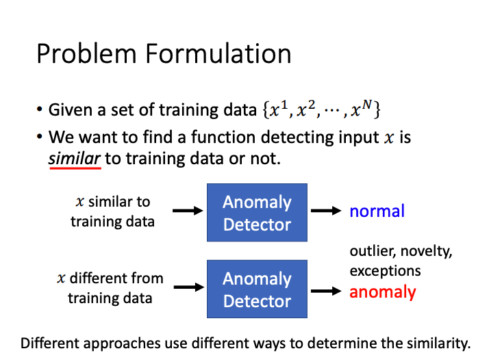
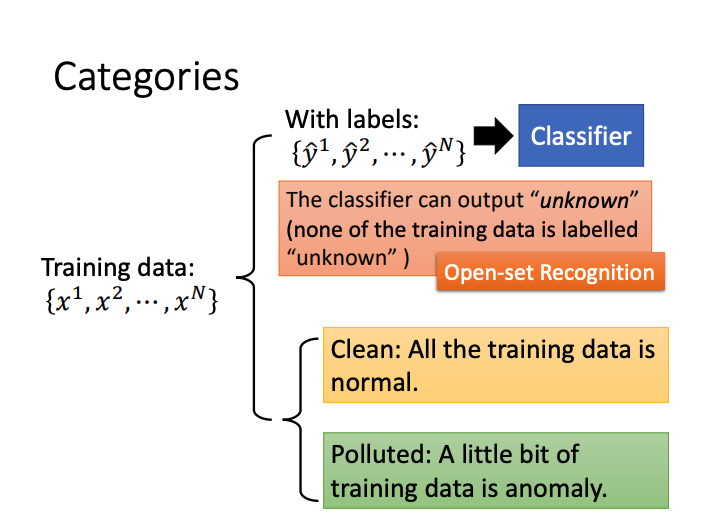
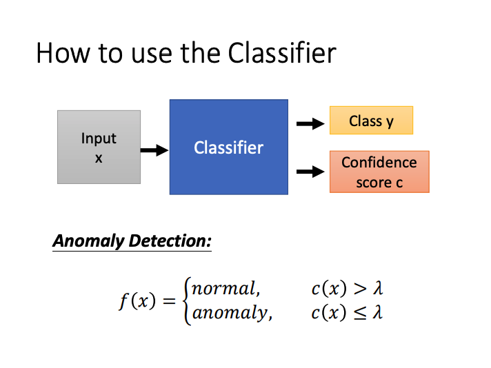
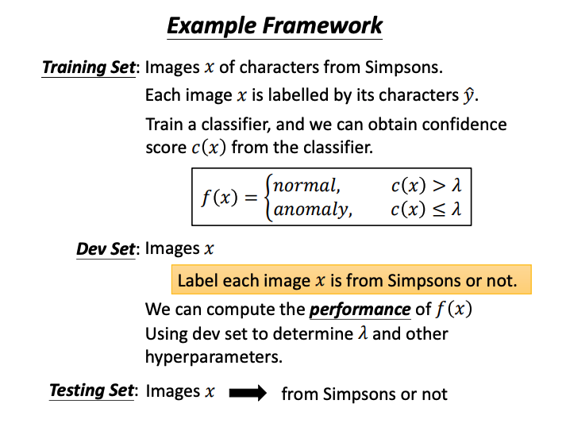
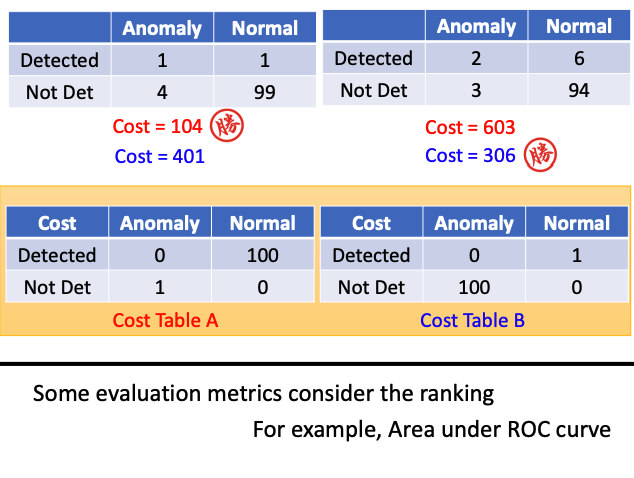
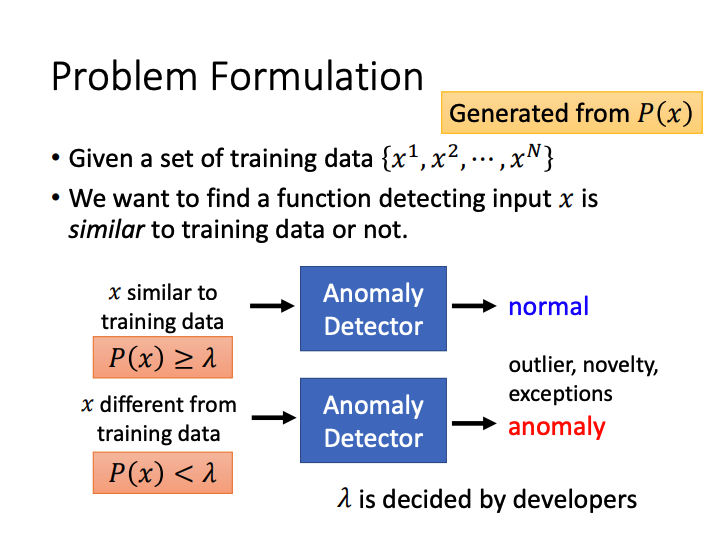
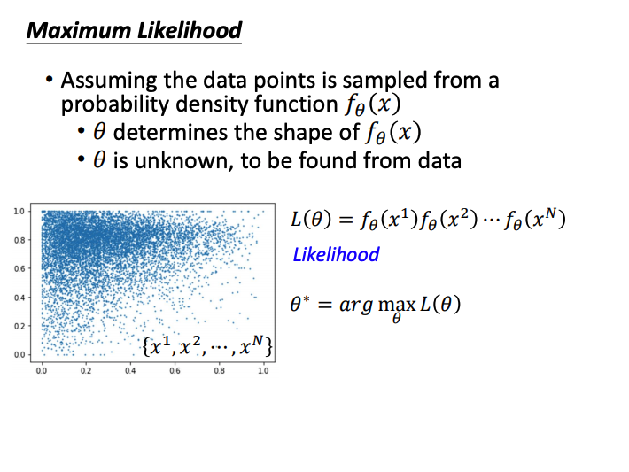
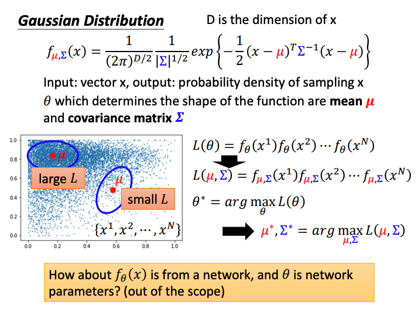

# Anomaly Detection

检测 input 是否与训练数据相似。

- **应用实例:**
  - Fraud Detection : 欺诈检测
    Training data : 正常刷卡行为; Anomaly : 盗刷
  - Network Intrusion Detection : 网络入侵检测
    Training data : 正常连接; Anomaly : 攻击行为
  - Cancer Detection : 癌症检测
    Training data : 正常细胞; Anomaly : 癌细胞  

**异常检测的一般思路:**
1. **给定正常数据**${x^1,x^2...x^N}$ **: Class 1**
2. **给定异常数据**${y^1,y^2...y^N}$ **: Class 2**
3. **训练一个二分类器 (Binary classifier)**

## Categories

#### Case1 : With Classifier

Confidence score : The maximum scores or negative Entropy.

**Evaluation:**

Accuracy is not a good measurement. A system can have high accuracy but do noting.

***正负样本分布不均衡 :*** 正常数据(Training data)远多余异常数据(Anormaly data).

#### Case2 : Without Labels

高斯相似度计算参考[吴恩达机器学习-异常检测](Wu_ML/Notes/Notes_3.md)

## OutLook: Auto-Encoder

通过训练得到Auto-Encoder也可实现异常检测