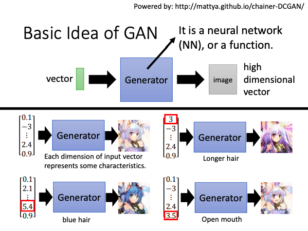
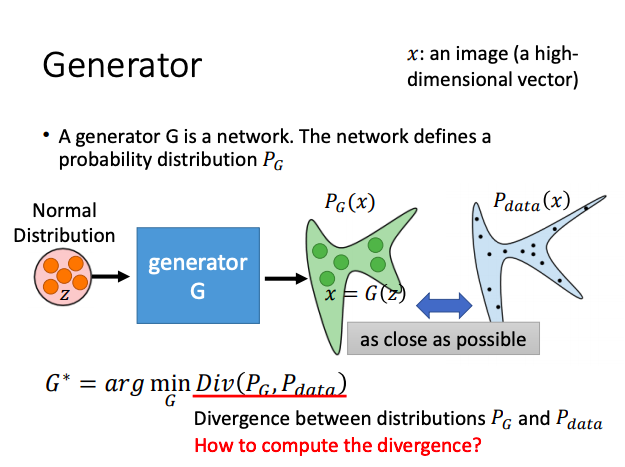
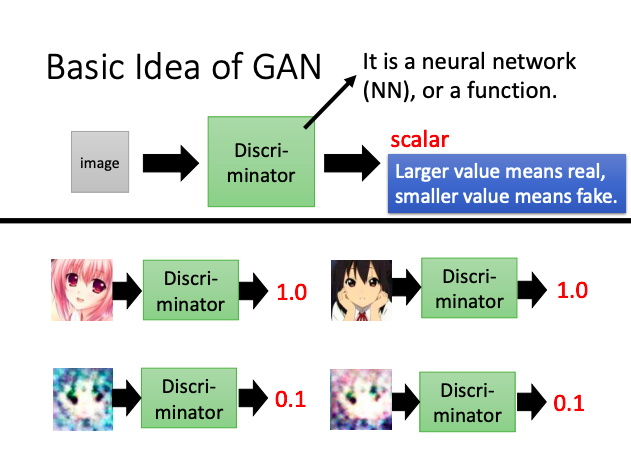
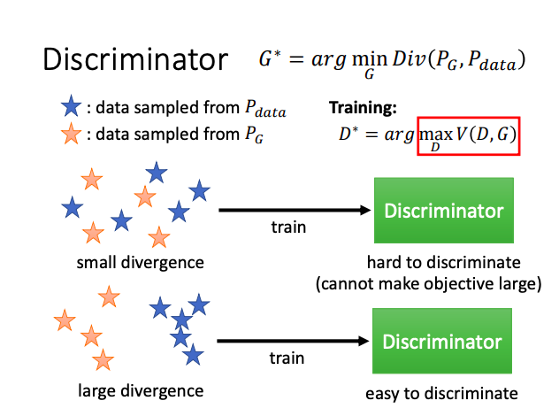
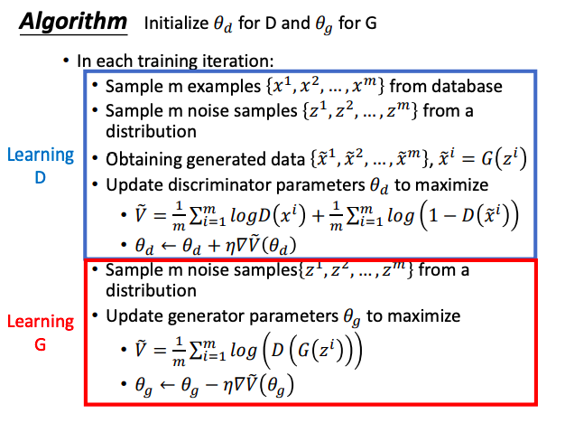
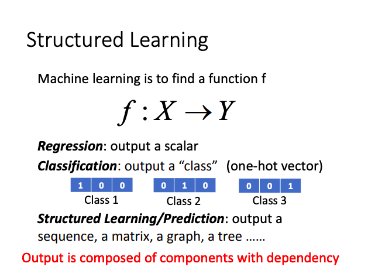
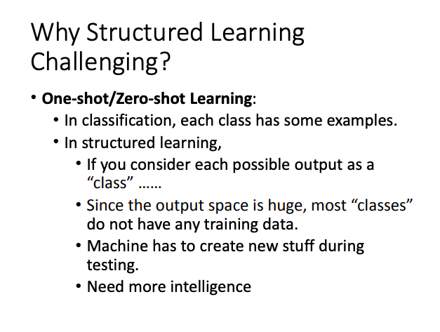
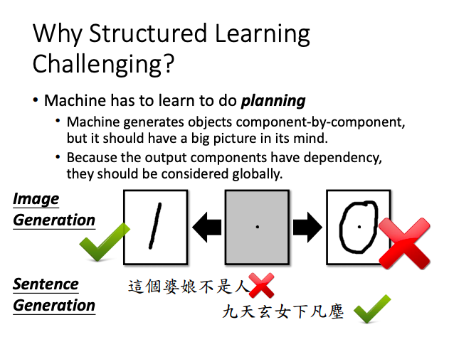
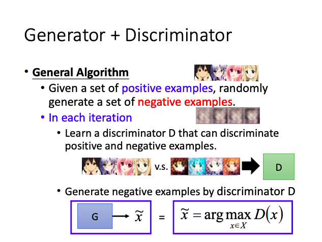
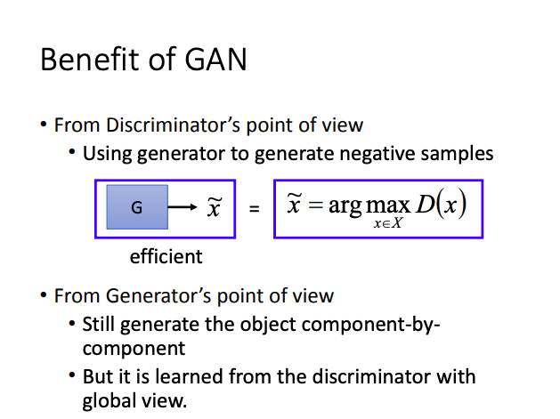

# Generative Adversarial Network

## Basic idea of GAN

### Generator

**Conditional Generation** : Will control what to generate latter. 

### Discriminator

**Discriminator —— Teacher, Generator —— Student.**

Discriminator tell the Generator where is not good enough.

### Train Algorithm

- **Algorithm:**
  - Initilaize generator and discriminator
  - In each training iteration:
    - **Fix Generator G, and update discriminator D**
      - Discriminator learns to assigh high scores to real projects and low scores to generator objects.
    - **Fix discriminator D, and update Generator G**
      - Generator learns to "fool" the discriminator

This is where the term **'adversarial'** comes from.

## GAN as Structured Learning

### Structured Learning

- **Output:**
  - **Output Sequence :**
    - ***Machine Trainslation*** : X - sentence of language 1 ; Y - sentence of language 2
    - ***Speech Recognition*** : X - speech ; Y - transcription
    - ***Chat-bot*** : X - what a user says ; Y - response of machine
  - **Output Image:**
    - ***Image to Image*** : X - input image ; Y - outpout image
    - ***Text to Image*** : X - input text ; Y - output image

### Why structure Learning Challenging ?

### Structured Learning Approach

***Bottom Up*** : **Generator** - Learn to generate the object at the component level.

***Top Down*** : **Discriminator** - Evaluating the whole object, and find the best one.

## Can Generator learn by itself ?

The relation between the components are critical. Although highly correlated, the cannot influence each other.

Need deep structure to catch the relation between components.

## Can Discriminator generate ?

Discriminator can used to generate.But Discriminator training needs some negative examples.

Discriminator needs general algorithm to generate negative examples.

## Benefit of GAN

