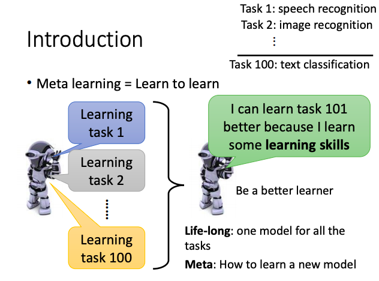

# Meta Learning

Learn to Learn

**Machine Learning : The ability to find a function based on data.**

**Meta Learning : The alility to a function that finding a function based on data.**

## Three Steps

- **Meta Learning is Simple**:
  - Define a set of Function f
  - Goodness of Function f
  - Pick the best Function f

**Function f** : the Learning algorithm to find function

### Define a set of learning algorithm

Replace humans with machines to define **Initialize parameters $\theta$** or **Gradient Update**.

### Define goodness of a funcation F

Using actual task to evaluate the generated model. Multi task multi test.

$L(F) = \sum_{n=1}^{N} l^{n}$ 

$N$ : N tasks.

$l^{n}$ : Testing loss for task n after training.

**Few-shot learning** : Small amount of label data

### Pick the best function F

### Bench mark

**Few-shot Classification** : Make sure that the training data and the test data don't overlap.

## MAML & Reptile

### MAML

**Only focus on initialization parameter.**

#### MAML v.s. Pre-Training

**Loss function is different.**

**Model Pre_training** : Train the model in the task with large dataset, and fine-tune in the task with small dataset.

- **MAML** :
  - Don't care about $\Theta$ performance in training task .
  - Care about the $\theta^{n}$ training by $\Theta$ .
- **Model Pre-training** :
  - Find the $\Theta$ that suit all task .
  - No guarantee that will get good $\theta^{n}$ training with $\Theta$ .

Update Once, MAML can get good performance parameters.

Use the gradient of $\theta^{n}$ update $\Theta$.

### Reptile

**Different gradient update ways.**

**MAML and Reptile : depend on gradient descent.**

## Gradient Descent as LSTM

Input Gate and Forget Gate initialize artificially.

Different from normal LSTM : $C_t$ will affect the $X_t$, the present parameters will affect next input.

**The initial parameters determine the direction**

Middle LSTM works like momentum, save the previous gradient descent.