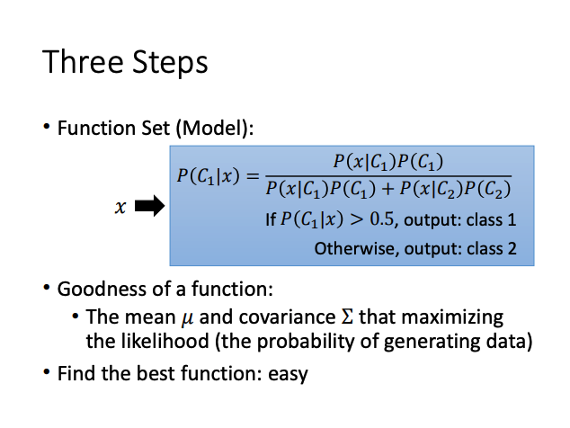

# Notes.1 ML

## Machine Learning

### 优化目标

**1. 学习目标**

***What we really care about is the error on new data.***

以在训练集上的期望训练风险代替在真实数据上的期望泛化误差。基于最小化平均训练误差的训练过程称为 *经验风险最小化*。

**2. 学习过程**

*1. Design Model*

*2. Goodness of Function*

在机器学习问题中，关注的某些性能度量 $P$ ，如分类问题中的Accuracy，Recall，F1-Score，很大可能都是在测试集上不可解的。因此通过定义LossFunction $J(\theta)$ 来提高 $P$ 。

***Input a function ,ouput how bad it is.*** LossFunction的作用就是衡量参数 $\theta$ 的好坏。

*3. Gradient Descent*

原理基础：***Taylor Series 泰勒展开式***

**3. Smooth function**

***Regularization*** 可避免过拟合（Overfitting） $L(\theta) = J(\theta) + \lambda \sum (\theta)^2$

当测试集中存在noise data时，smooth function 收到噪声输入的影响较小。

***Prefer smooth function bue not too smooth.***

***Gradient*** 的方向为 loss 等高线的法线方向。

## Regression & Classification

**4. 自适应学习率算法**

见下章~

**5. Generative Vs Discriminative**

***Generative***

高斯分布计算先验概率，根据贝叶斯公式，假设各特征之间相互独立，计算后验概率。

即通过贝叶斯计算所需的参数 $w$ 和 $b$。

***Vs***

生成模型相比需要更少的数据，但是贝叶斯假设各个特征之间相互独立，但实际情况可能并不如此，因此生成式的效果可能不如区别式。

**6. Logistic Regression**

为什么不能用在逻辑回归中应用均方差（MSE）？

MSE + Sigmoid 函数计算梯度时会导致梯度近似为0，无法有效收敛至局部最小值。

***Limitation of Logistic Regression***

逻辑回归的特征计算部分，可能找不到有效的transformation。
