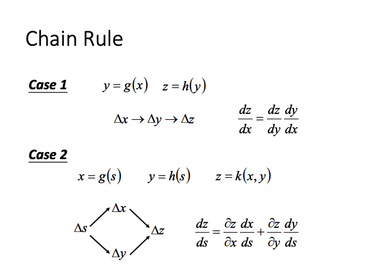
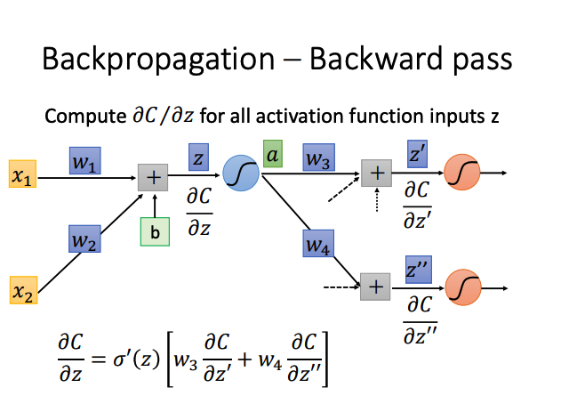
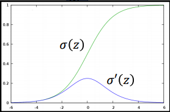
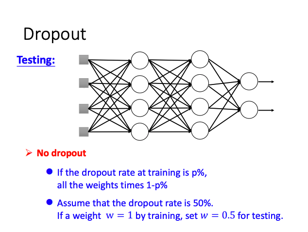
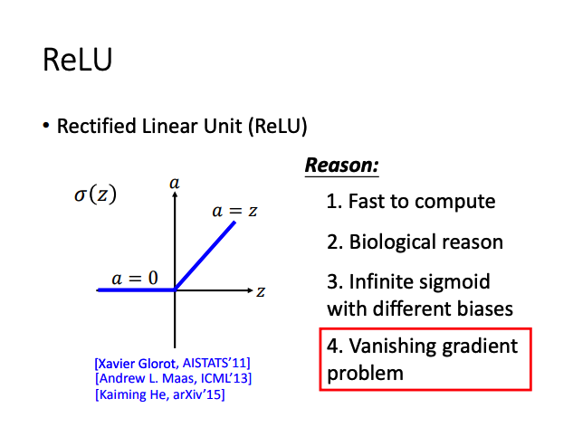
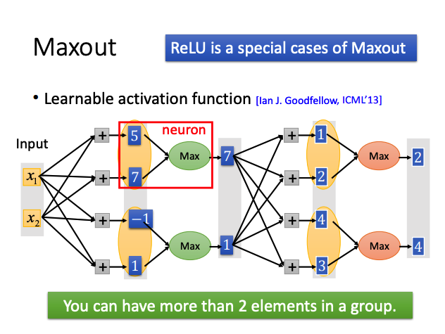

# Notes.2 Deep Learning

## Three Steps

### 1. Define a function set

***Give network structure,define a function set***

**Deep → Many hidden layers**

Hidden layer : Feature extractor, replacing feature engineering.

***Decide the network structure to find the best function***

### 2. Goodness of function

### 3. Pick the best function

**Backpropogation** : Compute gradient efficiently

BP算法本质上还是Gradient Descent.

## Why Deep Learning?

### 1. Fat & Short Vs Thin & Tall

### 2. Modularizaton

**Deep → Modularization**

***Shallow network can represent any function, but using deep structure is more effective.***

相比 Fat Model,Deep Model 需要更少的数据进行训练。并且通过 Modularization 可自动从数据中学习参数（**End-to-End training**）,可减少特征工程量和人工操作。

***Less engineering labor, but machine learns more.***

## BackPropagation

**Backpropagation : Gradient Descent + Chain Rule**

### Chain Rule

### Forward pass & Back pass

$\frac{\partial C}{\partial w} = \frac{\partial z}{\partial w} \frac{\partial C}{\partial z}$

**Forward psaa:** Compute $\frac{\partial z}{\partial w}$ for all **parameters**
 
**Back pass:** Compute $\frac{\partial C}{\partial z}$ for all **activation function inputs z**

**1. Forward pass**

Forward pass 本质为一阶求导。 $\frac{\partial z}{\partial w_i} = x_i$ 所得值为与 $w$ 相连的输入值。

**2. Back pass**

Back pass 的计算过程实际是应用链式求导法则计算计算反向梯度的过程。可将这个过程看做一个反向的Neural Network进行计算。

其中$ a = \sigma(z)$ , $\sigma(z)$ 为 Sigmoid Function。

对于每一个 **activation function** 的输入 $z$ ,应用 Back pass 直至 $C$ 为输出层的误差。

## Tips for Deep Learning

***Do not always blame Overfitting.***

深度神经网络中模型效果不佳可能是训练过程中效果不好 **（Underfitting）** 或者发生了过拟合 **（Overfitting）** 。

### Good Results on Training Data ?

#### 1. Early Stopping

#### 2. Regularization

#### 3. Dropout

***Dropout is a kind of ensemble.***

在训练过程中，每个节点有 $p \%$ 的概率被dropout。每次训练都近似于一个新的网络，每次被保留的节点，则实现了参数共享。

多次训练结束后，近似于训练了多个不同结构的网络，因此在测试过程中，要多对个不同结构的网络结果求平均值。因此在训练过程中，所有的参数要乘 $1-p\%$。

### Good Results on Testing Data ?

#### 1. New activation function

**Vanishing Gradient Problem**

Sigmoid函数将数值映射至$(0,1)$区间内。

**ReLU**

当 $z < 0$ 时，激活函数输出为0，梯度也为0，此时网络相当于一个删除部分节点的Thinner network。更新的节点不再有更小的梯度值。

**Maxout**

ReLU 是 Maxout 的一种特殊情况。

***Activation function in maxout network can be any piecewise linear convex function***
***How many pieces depending on how many elements in a group***

#### 2. Adaptive Learning Rate

**Adagrad**

**RMSProp**

**Momentum**

**Adam**