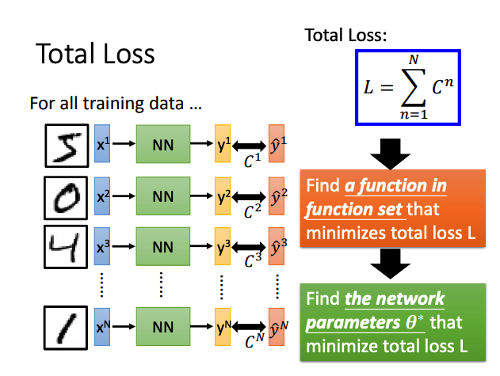
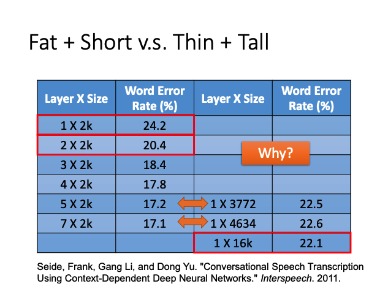
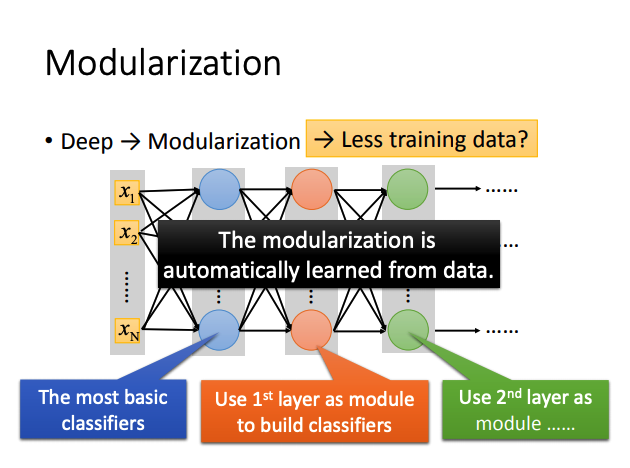
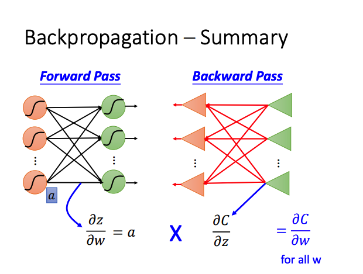
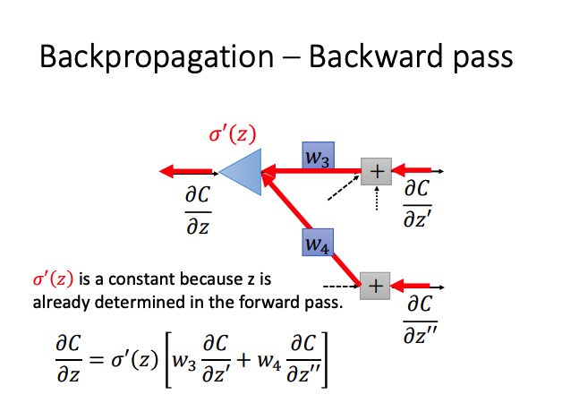
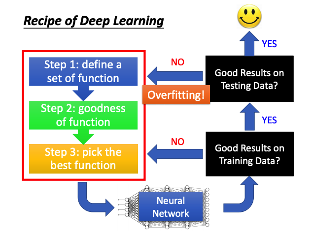
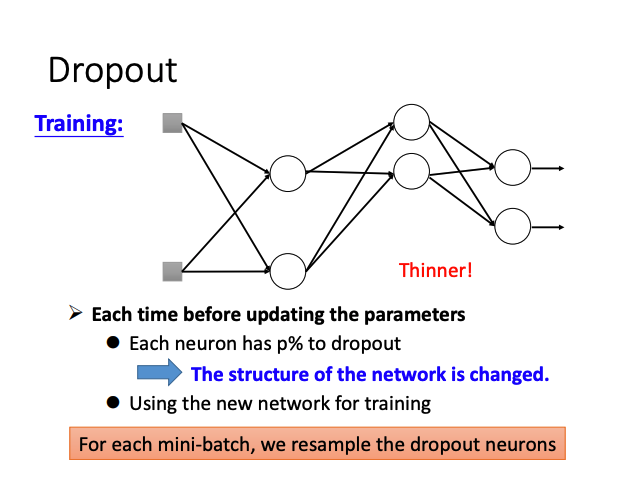
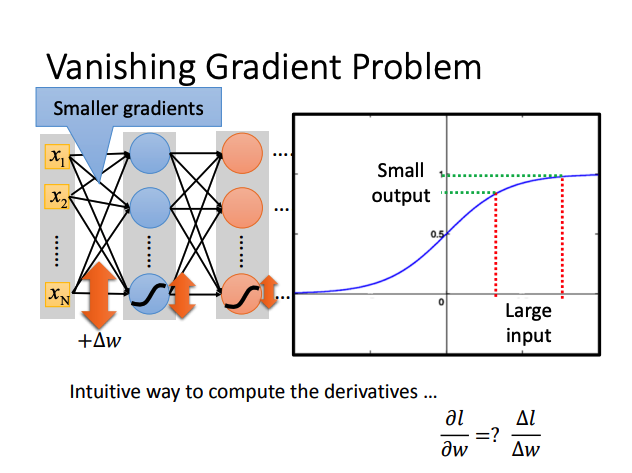

# Notes.2 Deep Learning

## Three Steps

### 1. Define a function set

***Give network structure,define a function set***

**Deep → Many hidden layers**

Hidden layer : Feature extractor, replacing feature engineering.

***Decide the network structure to find the best function***

### 2. Goodness of function



### 3. Pick the best function

**Backpropogation** : Compute gradient efficiently

BP算法本质上还是Gradient Descent.

## Why Deep Learning?

### 1. Fat & Short Vs Thin & Tall



### 2. Modularizaton

**Deep → Modularization**



***Shallow network can represent any function, but using deep structure is more effective.***

相比 Fat Model,Deep Model 需要更少的数据进行训练。并且通过 Modularization 可自动从数据中学习参数（**End-to-End training**）,可减少特征工程量和人工操作。

***Less engineering labor, but machine learns more.***

## BackPropagation

**Backpropagation : Gradient Descent + Chain Rule**

### Chain Rule


### Forward pass & Back pass



$\frac{\partial C}{\partial w} = \frac{\partial z}{\partial w} \frac{\partial C}{\partial z}$

**Forward pass:** Compute $\frac{\partial z}{\partial w}$ for all **parameters**
 
**Back pass:** Compute $\frac{\partial C}{\partial z}$ for all **activation function inputs z**

**1. Forward pass**

Forward pass 本质为一阶求导。 $\frac{\partial z}{\partial w_i} = x_i$ 所得值为与 $w$ 相连的输入值。

**2. Back pass**


Back pass 的计算过程实际是应用链式求导法则计算计算反向梯度的过程。可将这个过程看做一个反向的Neural Network进行计算。


其中$ a = \sigma(z)$ , $\sigma(z)$ 为 Sigmoid Function。



对于每一个 **activation function** 的输入 $z$ ,应用 Back pass 直至 $C$ 为输出层的误差。

## Tips for Deep Learning



***Do not always blame Overfitting.***

深度神经网络中模型效果不佳可能是训练过程中效果不好 **（Underfitting）** 或者发生了过拟合 **（Overfitting）** 。

### Good Results on Training Data ?

#### 1. Early Stopping

#### 2. Regularization

**参数范数惩罚**
  
及正则化厚的目标函数为$J^{*}$:

$$J^{*}(\theta,X,y) = J(\theta,X,y) + \alpha\Omega(\theta)$$

选择不同的参数范数$\Omega(\theta)$会偏好不同的解。
  
**L2正则化**
    
$$\Omega(\theta) = \frac{1}{2}|| w ||_{2}^{2}$$

L2范式正则化使在显著减小目标函数方向上的参数保留完好，在无助于目标函数见效的方向上改变参数不会显著增加梯度，不重要的方向会在训练过程中因正则化而衰减掉。
    
**L1正则化**

$$\Omega(\theta) = || w ||_{1}$$

相比L2正则化，L1正则化会产生更稀疏的解，最优解中的一些参数为0。其稀疏性质被广泛应用于**特征选择**。

#### 3. Dropout

***Dropout is a kind of ensemble.***


在训练过程中，每个节点有 $p \%$ 的概率被dropout。每次训练都近似于一个新的网络，每次被保留的节点，则实现了参数共享。



多次训练结束后，近似于训练了多个不同结构的网络，因此在测试过程中，要多对个不同结构的网络结果求平均值。因此在训练过程中，所有的参数要乘 $1-p\%$。

### Good Results on Testing Data ?

#### 1. New activation function

**Vanishing Gradient Problem**



Sigmoid函数将数值映射至$(0,1)$区间内。

**ReLU**


当 $z < 0$ 时，激活函数输出为0，梯度也为0，此时网络相当于一个删除部分节点的Thinner network。更新的节点不再有更小的梯度值。

**Maxout**


ReLU 是 Maxout 的一种特殊情况。

***Activation function in maxout network can be any piecewise linear convex function***

***How many pieces depending on how many elements in a group***

#### 2. Adaptive Learning Rate

**AdaGrad**

```python
# 初始化小常数 elpha, 梯度累积变量
lr, r, elpha = 1e-5, 0, 1e-7 
for batch in data_loader:
    # 计算梯度
    gradient = np.sum(loss(predict, label))/batch.size(0)
    # 累积平方梯度
    r = r + np.power(gradient, 2)
    # 计算更新,逐元素的应用除和求平方根
    delta_theta = lr / (elpha + np.power(gradient, 1/2)) * gradient
    # 应用更新
    theta -= delta_theta
```

AdaGrad 在参数空间中更为平缓的倾斜方向会取得更大进步。

**动量 Mesterov**

原始SGD算法梯度更新方法为:
```python
theta = theta - epsilon * gradient
```
使用动量后，SGD算法的梯度更新方法为：
```python
v = alpha * v + epsilon * gradient
theta = theta - v
```
v的速度由 gradient 决定，如果动量算法总观测到梯度为 $g$ ，那么其会在 $-g$ 的方向不断加速，最终达到最终速度 $\frac{\epsilon * || g ||}{1 - \alpha}$。可有效防止梯度计算动荡，加速学习。

**RMSProp**

相比AdaGrad算法，RMSProp改变梯度积累为指数加权的移动平均，在非凸设定下效果更好。RMSProp在计算初始时二阶矩可能具有很高的偏置。

```python
# 初始化学习率 lr, 梯度累积变量 r, 小常数 elpha, 衰减速率 p
lr, r, elpha, p = 1e-5, 0, 1e-6, 1e-1
for batch in data_loader:
    # 计算梯度
    gradient = np.sum(loss(predict, label))/batch.size(0)
    # 累积平方梯度
    r = p*r + (1-p)*np.power(gradient, 2)
    # 计算更新
    delta_theta = lr / (elpha + np.power(gradient, 1/2)) * gradient
    # 应用更新
    theta -= delta_theta
```

**Adam**

Adam可看作是RMSProp结合动量的变种，并且增加了一阶矩和二阶矩的偏执修正，对超参数选择相当鲁棒。

**谨慎选择学习率！**

```python
# 初始化学习率 lr, 矩估计指数衰减速率 p1、p2, 用于数值稳定的小常数 elpha, 一阶矩变量 s、 二阶矩变量 r
lr, p1, p2, elpha, s, r = 1e-3, 0.9, 0.999, 1e-8, 0, 0
# 初始化时间步
t = 0
for batch in data_loader:
    # 计算梯度
    gradient = np.sum(loss(predict, label)) / batch.size(0)
    t += 1
    # 更新有偏一阶矩估计
    s = p1*s + (1-p1)*gradient
    # 更新有偏二阶矩估计
    r = p2*r + (1-p2)*np.power(gradient, 2)
    # 修正一阶矩的偏差
    s_ = s /(1 - p1_t)
    # 修正二阶矩的偏差
    r_ = r /(1 - p2_t)
    # 计算更新,逐元素应用
    delta_theta = lr * s_ / (np.power(r_, 1/2) + elpha)
    # 应用更新
    theta -= delta_theta
```

#### Tips for training

**Sigmoid**

**Normalization**