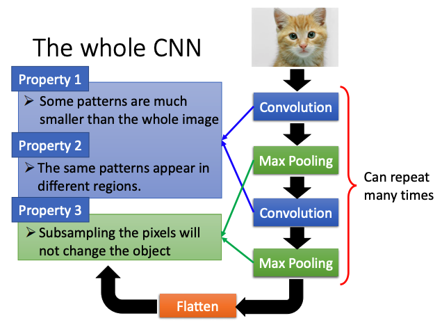
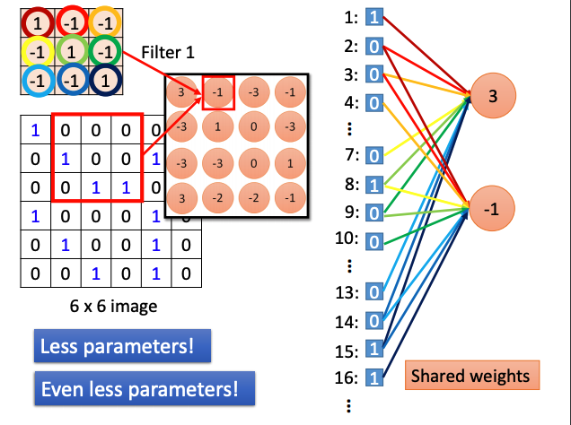
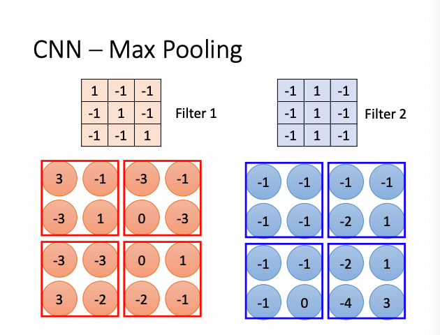
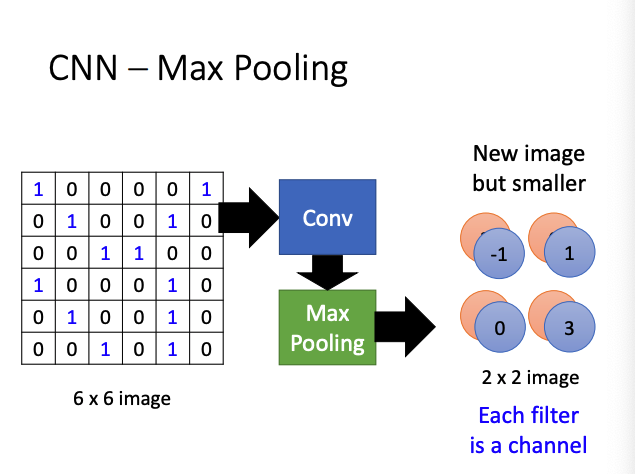
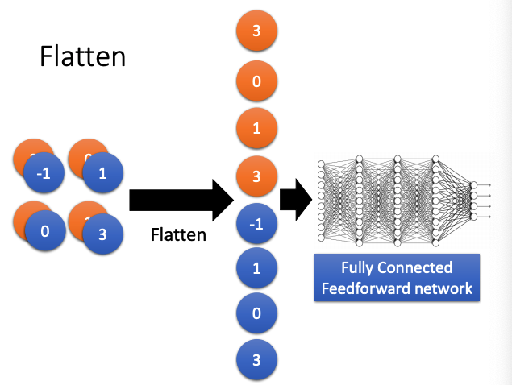

# Notes.3 CNN

## CNN

### Why CNN ？

- **Why CNN for Image ?**
  - **Some patterns are much smaller than the whole image.**
    - A neuron does not have to see the whole image discover the pattern.
    - Connecting to small region with less parameters.
  - **The small patterns appear in different regions.**
    - Different part do almost the same thing,they can use the same set of parameters.
  - **Subsampling the pixels will not change the object.**
    - Less parameters for the network to process the image.

### Convolution

**卷积核(Filter)** 与输入特征值做内积（对应位相乘加和）。是CNN需要学习的参数。

每个卷积核（Filter-size：$n*n$）只和 $n*n$ 个输入相连接，而非与所有收入全连接。

即**减少参数量**又实现**参数共享**。

### Pooling

**最大池化(Max Pooling)** 

经过池化，可得到一个新的更小的图像。***Each filter is a channel,the number of the channel is the number of filters.***

池化操作后，会丢失输入原有的位置信息。

### Flatten

### Application

## GNN

GNN (Graph Neural Network)

G - Graph : Node 节点 + Link 边 -> Relationship + Structure

