# Explainable AI

**Not only get good accuracy, but also know why.**

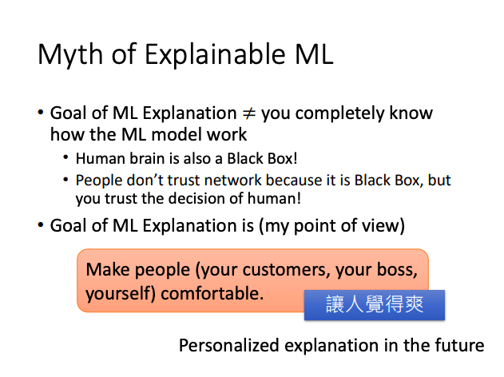

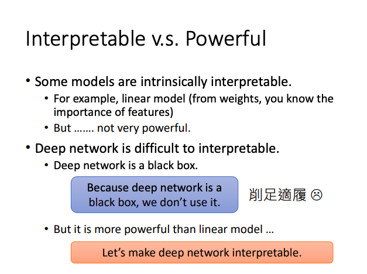

## Local Explanation

**Explain the Decision** : Why do you think this image is a cat?

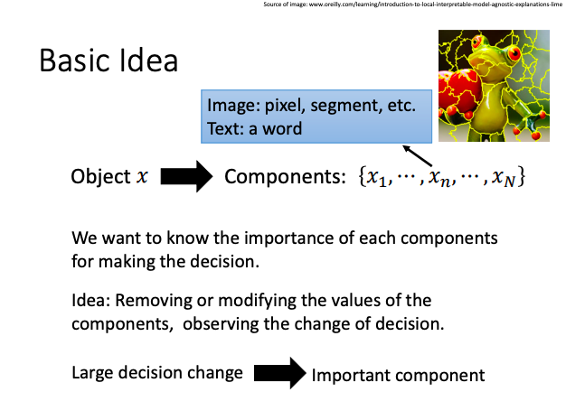

### Gradient Based Approaches

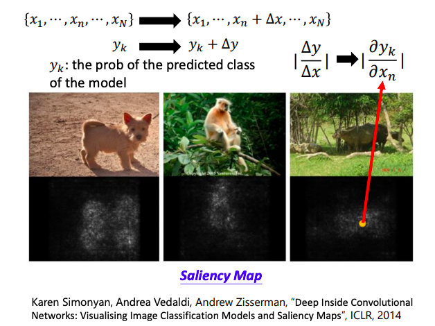

**Bigger gradient, most important component.**

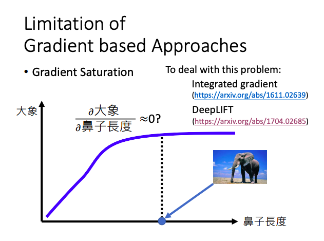

### Attack Interpretation

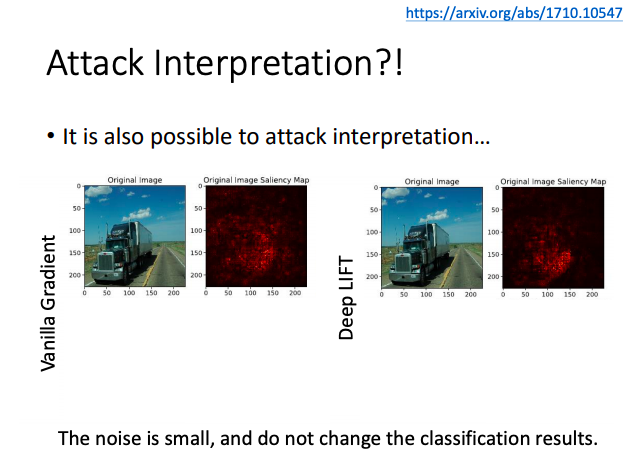

**By use samll noises to find the most important component.**

## Global Explaination

**Explain the Whole Model** : What do you think a 'cat' looks like?

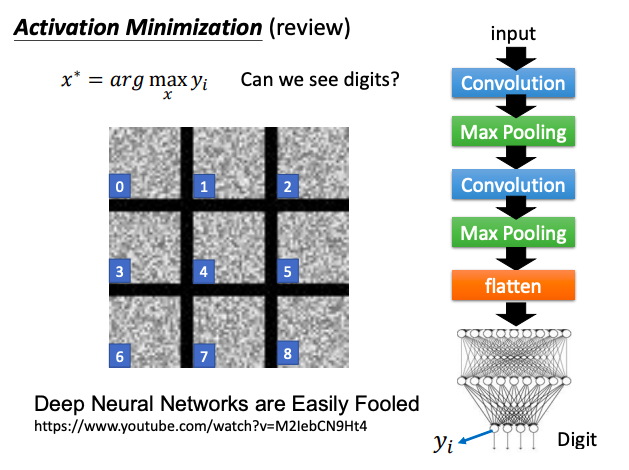

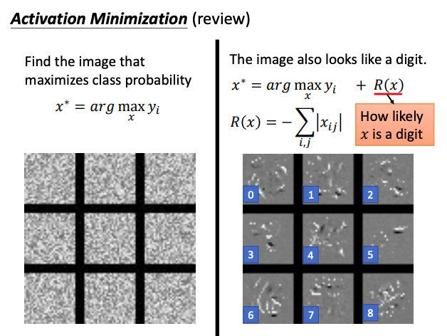

### Constraint from Generator

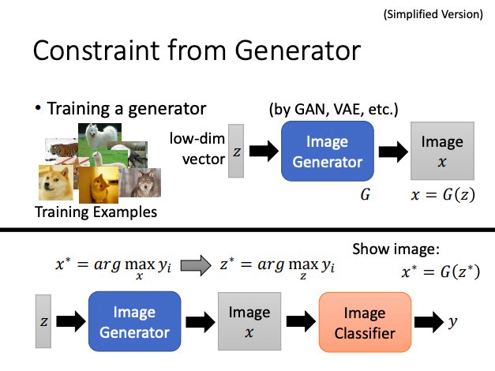

## Using a model to explain another

**Some models are easier to interpret. Using interpretable model to minic uninterpretable models.**

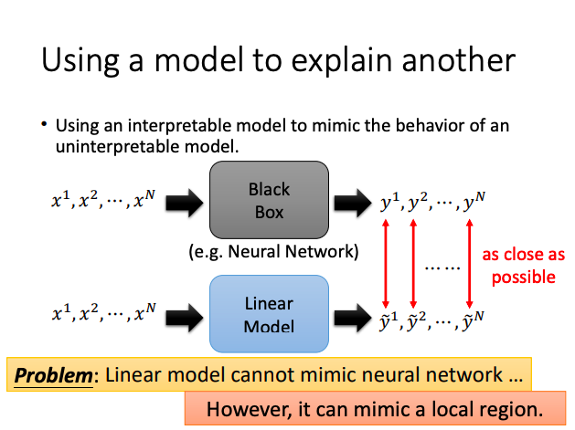

- **Agnostic Explanations (LIME)**
  - 1. Given a data point you want to explain.
  - 2. Sample at the nearby.
  - 3. Fit with linear model(or other interpretable models).
  - 4. Interpret the linear model.

### Decision Tree

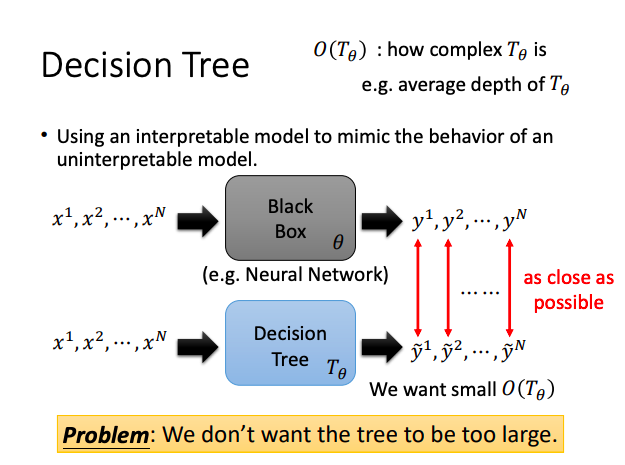

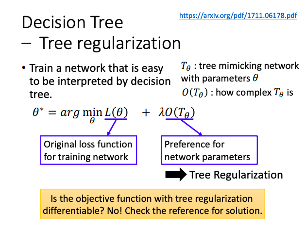