# Adversarial Attack

## Attack

Find the most effective $\Delta x$ to fool the  Network.

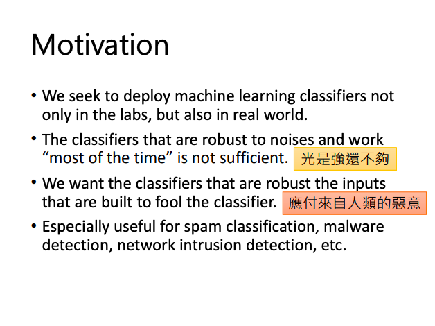

### How to attack?

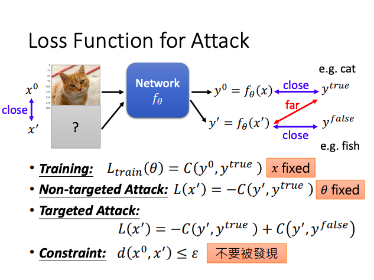

**Non-Target Attack** : Stay far from $y_{true}$

**Target Attack** : Far from the correct answer, but close to the specific error

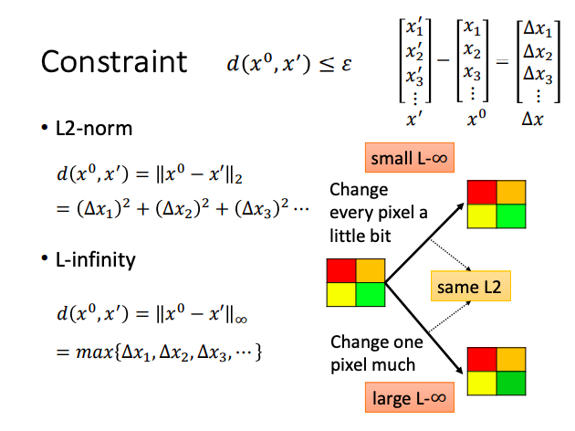

**L-infinity applies to Image Attack** : Change every pixel a little bit, not change one pixel much.

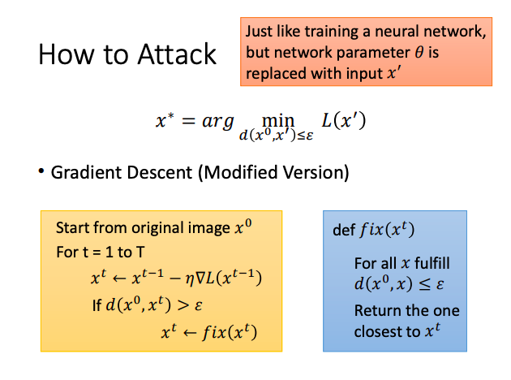

Replace $x$ with the $x_t$ that satisfies the condition and is closest to the original $x$.

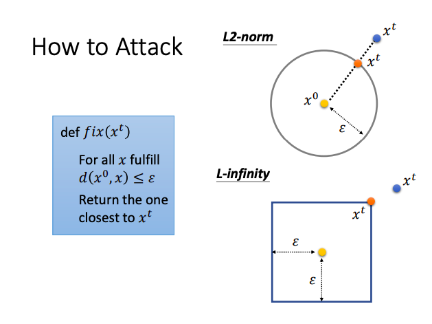

- **Different Attack Method** :
  - **Different optimization methods**.
  - **Different constraints**.

### FGSM

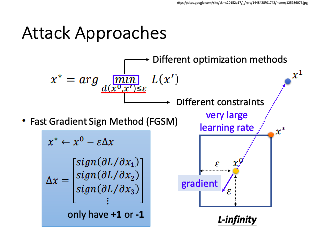

**Consider only the direction, not the magnitude.**

Is equivalent to using a large Learning Rate.

### White Box v.s. Black Box

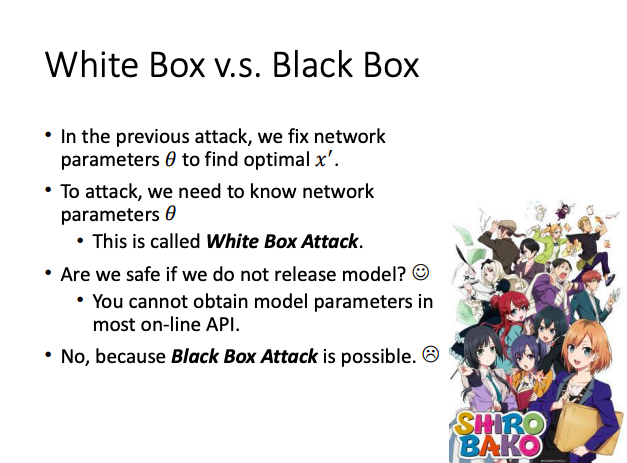

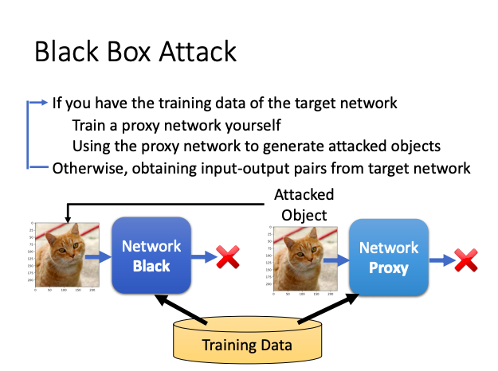

### Unversal Adversarial Attack

Find an special $\Delta x$ that make all inputs wrong .

## Defense

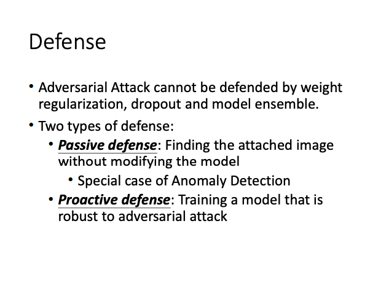

### Passice Defense

**Add a shield : Finding the attacked Image without modifying the model.**

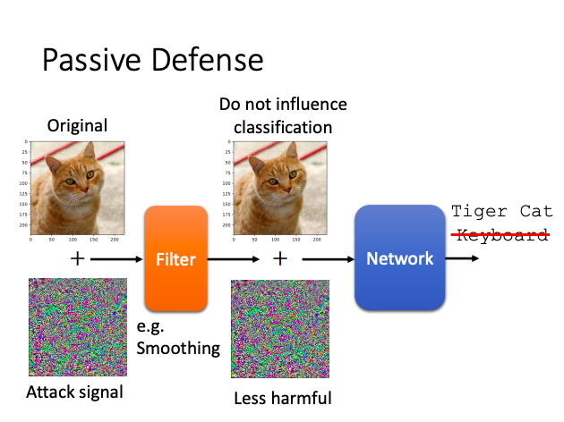

### Proactive Defense

**Training a model that is robust to adversarial attack.**

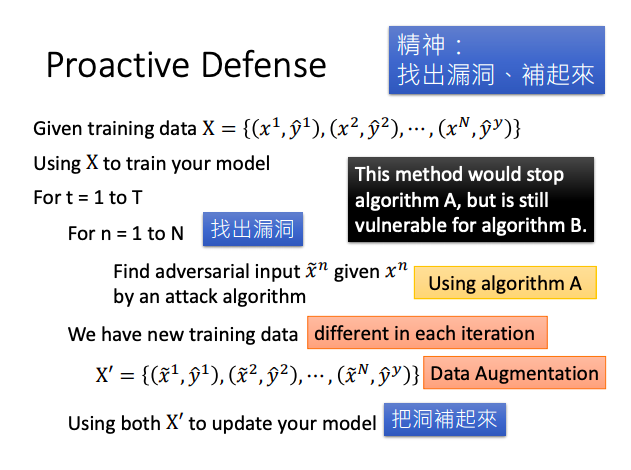

**Each iteration will find new vulnerabilities, but defense algorithm A can only work against attack algorithm A, not for attack algorithm B.**