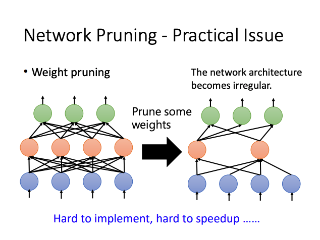
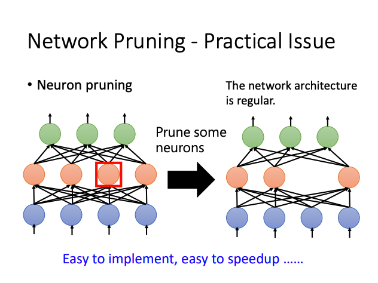
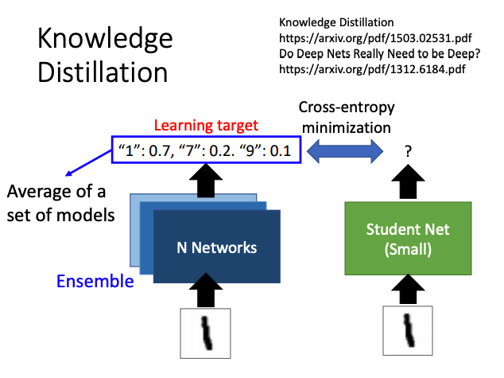
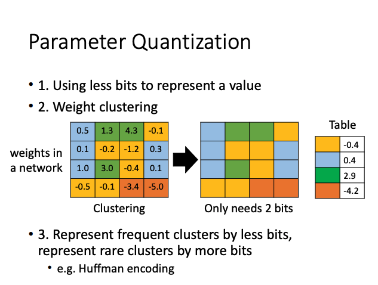
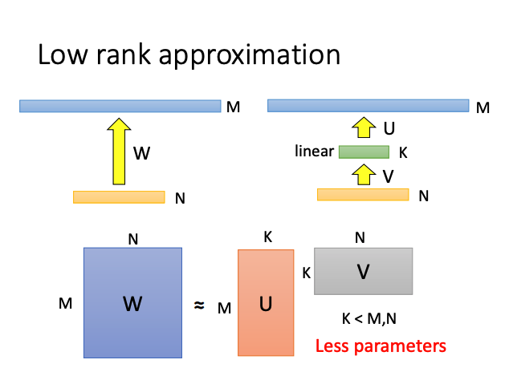
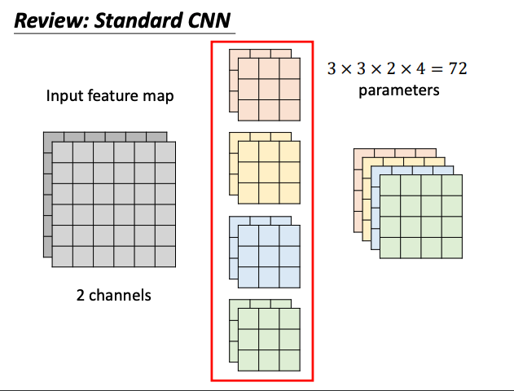
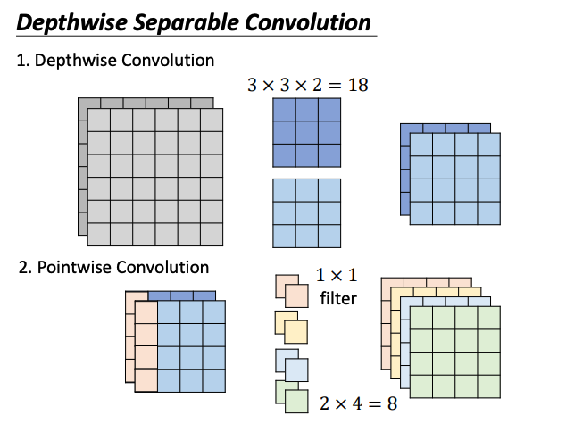
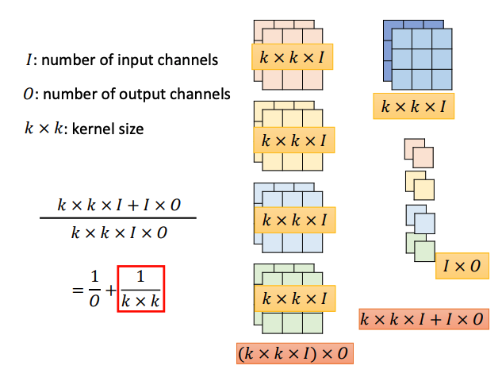
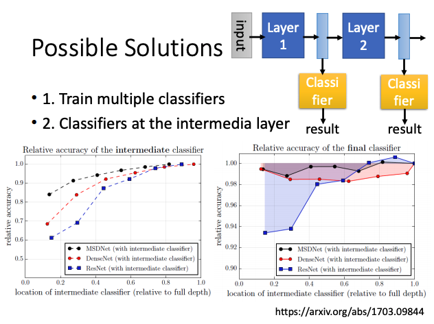

# Network Compression

## Network Pruning

### Pruning 

相比于大的模型，小模型难以优化。因此选择模型压缩而不是直接训练一个较小的模型。

#### Pruning Weights

#### Pruning Neuron

## Knowledge Distillation

用小模型学习大模型学得的知识。

## Parameter Quantization

## Architecture Design

通过更改网络结构减少参数量。

- **Depthwise Convolution**
  - **Filter number = Input channel number.**
  - **Each filter only consider one channel.**
  - **The filters are K*K matrices.**
  - **There is no interaction between channels.**

## Dynamic Computation

提高网络中间层的预测能力。