# Auto-Encoder

### Auto-Encoder
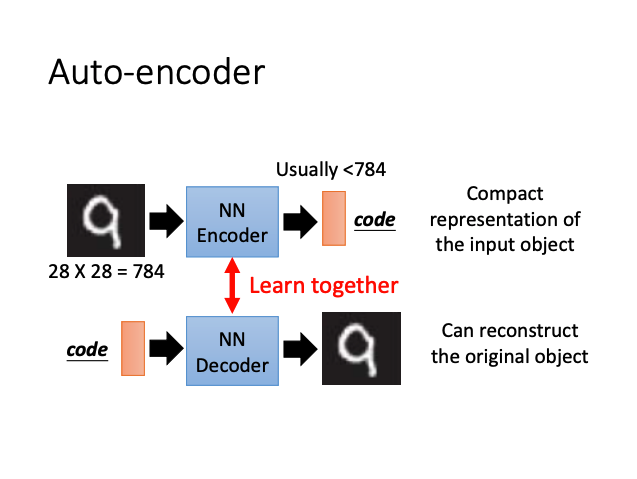

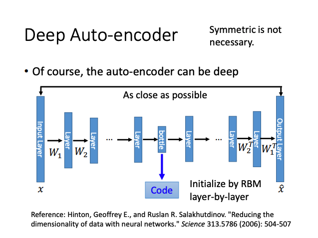

Output of the hidden layer is the code. Called Bottleneck later.
### Text Retrieval

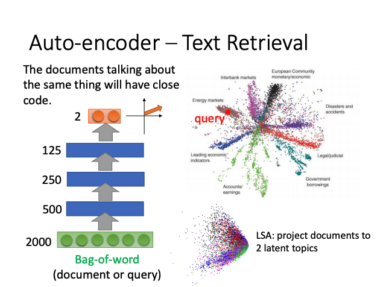

Semantics are not considered in Bag-of-word.

### Similiar Image Search

Retrieved using Euclidean distance in pixel intensity space.

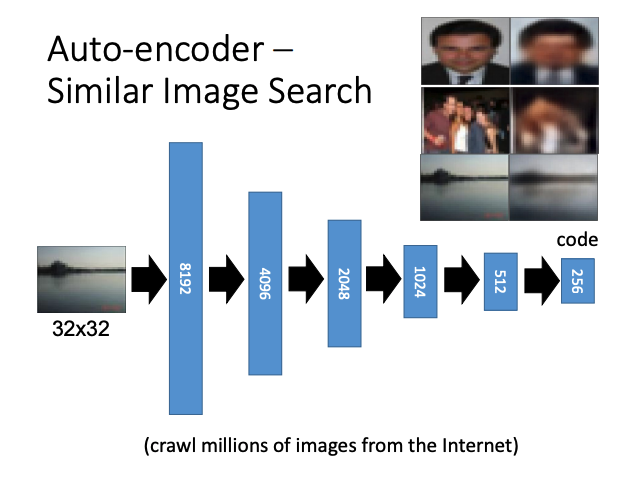

### Auto-Encoder for CNN

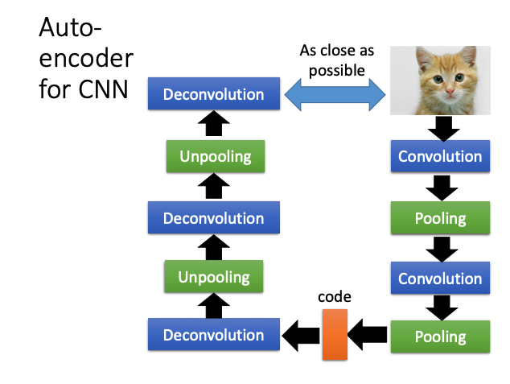

Auto-Encoder for CNN includes : **Deconvolution and Unpooling**

#### Deconvolution

**Deconvolution is similiar with convolution.**

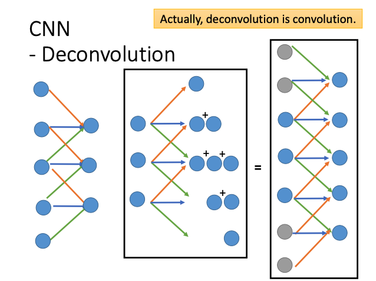

#### Unpooling

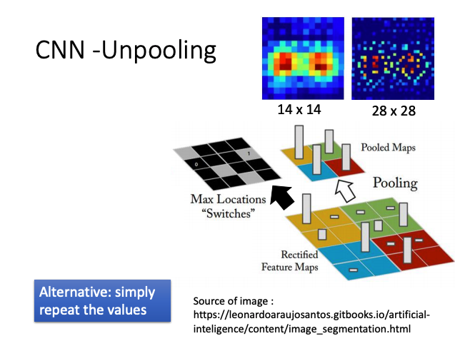

**Unpooling with the Max Locations Informations.**

### Pre-training DNN

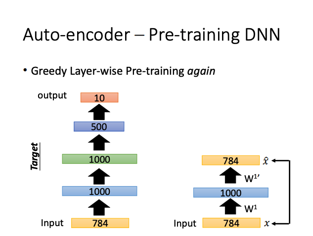

$W_1$ is the parameters that wants to be initialize.

Pre-training DNN 在含有大量无标签数据时可用。

当 input_size 小于hidden_size 时，如上图 784—1000，要对 $W_1$ 添加较大的正则化系数，以防将 input 复制进 hidden, 造成 hidden 稀疏。

### Good embedding ？

An embedding should represent the object.

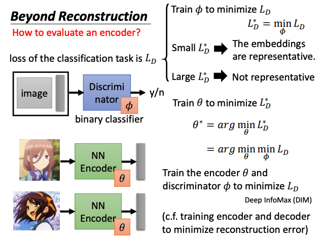

### Sequential Data

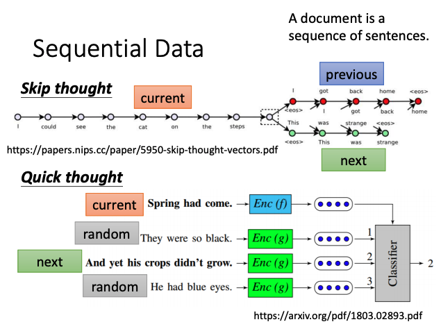

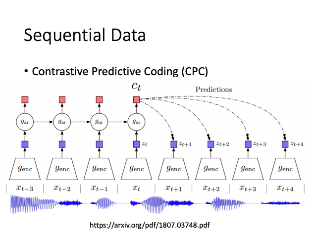

例：文本摘要

### Feature Disentangle

An object contains multilpe aspect information.The same sentence has different impact when it is said by different people.

- 一段语音：
  - 语音信息
  - 语者信息
- 一段文字
  - 语法信息
  - 语义信息

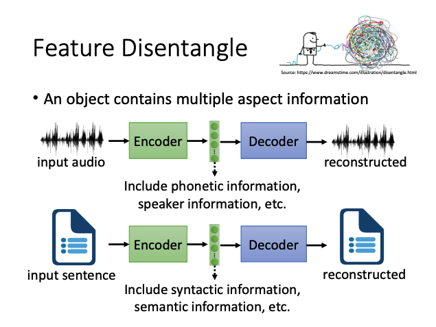

Such as : **Voice Conversion , Adversarial Training , Designed Network Architecture**

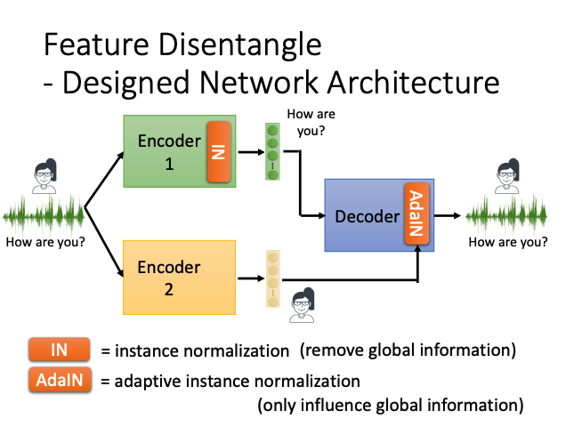

### Discrete Representation

Let embedding easier to interpret or clustering.Such as **One-hot vector** and **Binary Vector**.

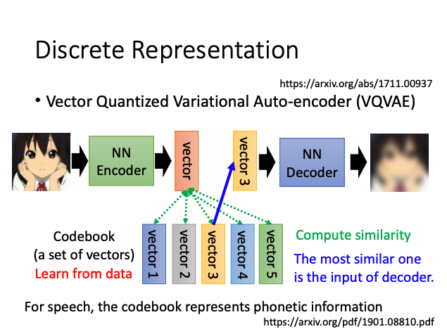

Let Discriminatorc consider the not readable summary as real

