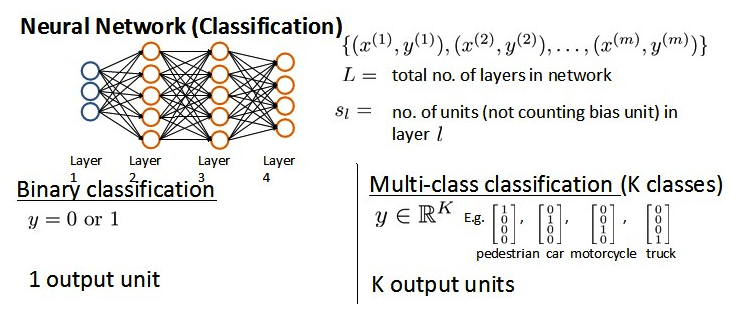
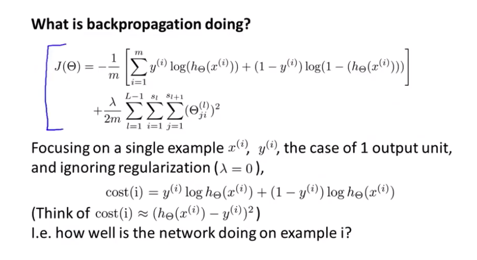
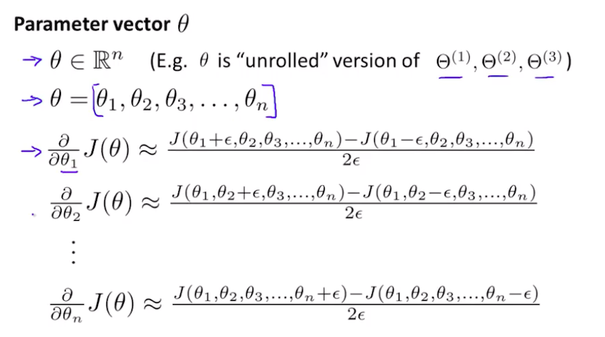
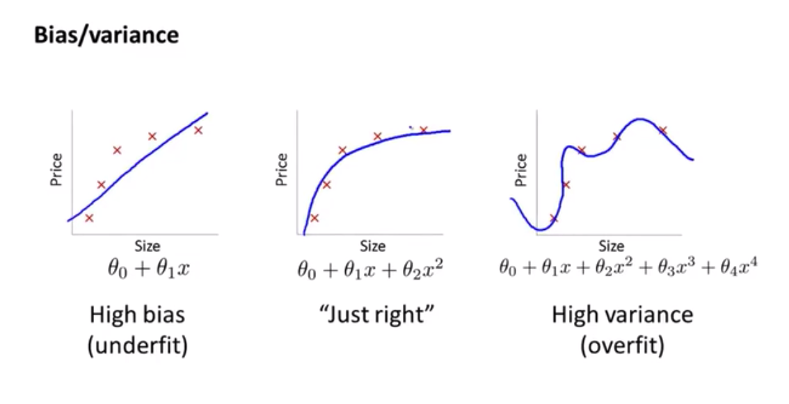
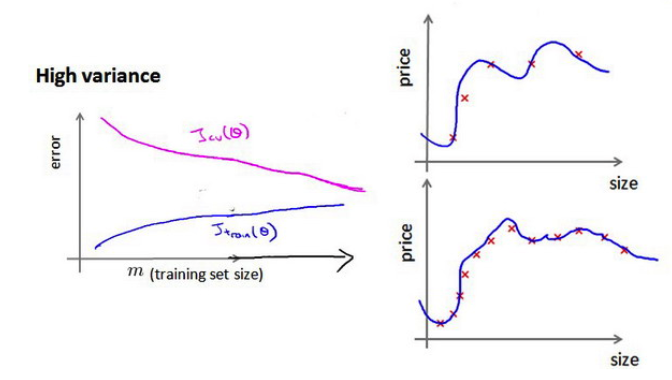

## 第二周笔记 Week_2

### 六、神经网络:表述(Neural Networks:Representation)

#### 6.1 非线性假设

无论逻辑回归还是线性回归，当特征数较多时，高阶多项式组合浪费空间、计算负荷较大，也比较容易出现过拟合。如果删除部分特征，又会导致信息缺失。

#### 6.2 模型表示

构建神经网络模型：

$x_1,x_2,x_3$代表输入单元，$Layer 1$为输入层（Input Layer）。

$a_i^{(j)}$代表第$j$层的第$i$个激活单元。$Layer 2$为隐藏层（Hidden Layers）。

$layer 3$为输出层（Output Layer）。最后输出层类似于逻辑回归算法，但不是使用输入的输入特征。

为表示为predict = dataFeature * parameters的形式，考虑偏置值($Bias$)，将神经网络模型进行改写,针对每一层增加偏置值：

从左至右的过程为前向传播算法 **(Forward propagation)**。

神经网络自行学习特征而不是使用输入数据的初始特征，通过隐藏层计算更加复杂的特征，$\theta$的作用就是选择下一层的新的特征。

由输入层至隐藏层：

由隐藏层至输出层：

如果在第$j$层有$s_j$个单元，在$j+1$层有$s_{j+1}$个单元，则$\theta^{(j)}$的维度为$s_{j+1} * (s_j + 1)$。

#### 6.3 样本和直观理解

XNOR

#### 6.4 多类分类

在神经网络的输出层输出包含多个元素的one-hot向量，可用作多累分类任务。

### 七、神经网络:学习(Neural Networks:Learning)

#### 7.1 代价函数

应用神经网络解决二分类和多分类问题。区别于逻辑回归的代价函数，逻辑回归中只有一个因变量y，只输出一个标量（Scalar）。神经网络在解决多分类（分类数为$K$）问题时，要输出多个变量，输出为一个$K$维的向量（Vector）。

神经网络进行多分类的代价函数为：$h_\theta(x) \in \reals^K. (h_\theta(x))_i = i^{th} output$

正则化的那一项只是排除了每一层$\theta_0$后，每一层的$\theta$矩阵的和。最里层的循环$j$循环所有的行（由 $s_l+1$ 层的激活单元数决定），循环$i$则循环所有的列，由该层（$s_l$层）的激活单元数所决定。

#### 7.2 反向传播算法

与逻辑回归相同，在得到代价函数之后，算法目的是为了求解$min_{\theta}J(\theta)$ ，而需要计算$\frac{\partial}{\partial\theta_{ij}^{(l)}}J(\theta)$.

也就是首先计算最后一层的误差，然后再一层一层反向求出各层的误差，直到倒数第二层。

前向传播算法：

反向传播算法：

首先计算最后一层的误差，为输出的prediction和label之间的误差:$\delta^{(4)} = a^{(4)} - y$。

利用第四层的误差即可计算前一层的误差$\delta^{(3)} = (\theta^{(3)})^T\delta^{(4)} * g'(z^{(3)})$其中$g'(z^{(3)}$是$S$形函数的导数，$g'(z^{(3)} = a^{(3)} * (1 - a^{(3)})$。而$(\theta^{(3)})^T\delta^{(4)}$则是权重导致的误差的和。

    y = f(x)
    y 造成的误差为 Delta
    x 造成的误差为 Delta * f'(x)

依次得到所有层误差吼，即可计算代价函数的偏导数，再不做任何正则化处理时：$\frac{\partial}{\partial\theta_{ij}^{(l)}}J(\theta) = a_j^{(l)}\delta_i^{l+1}$.

如果考虑正则化处理，并且训练集是一个特征矩阵而非向量。在上面的特殊情况中，我需要计算每一层的误差单元来计算代价函数的偏导数。在更为一般的情况中，需要计算每一层的误差单元，但是为整个训练集计算误差单元，此时的误差单元也是一个矩阵，用$\Delta_{ij}^{(l)}$来表示这个误差矩阵。第$l$层的第$i$个激活单元受到第$j$个参数影响而导致的误差。

前向传播算法：

反向传播算法：

反向传播过程中不需要对输入层考虑误差项，前向传播和反向传播计算方式相同只是计算方向不同。

展开参数，将所有参数展开为一个向量，将所有误差$\Delta$也展开为一个向量。

#### 7.3 梯度检验

梯度的数值检验：思想是通过估计梯度值来检验计算的导数值是否真的满足要求的。

只需验证结果，不用每次都进行梯度验证计算，占用计算资源。

#### 7.4 随机初始化

零初始化Zero Initialization:对于神经网络不适用，鉴于网络的对称性，会造成每次每个单元的梯度更新均相同。

#### 7.5 综合

1. **选择适合的网络架构**

    这里的架构指的是神经元的连接方式

    
   
    隐藏层默认选择一层，如果选取多个隐藏层，每层单元数一致（通常越多越好）

2. **训练神经网络**
    1. 参数的随机初始化
    2. 利用正向传播方法计算所有的$h_\theta(x^{(i)})$
    3. 编写计算代价函数$J$的代码
    4. 利用反向传播方法计算所有偏导数$\frac{\partial}{\partial\theta_{ij}^{(l)}}J(\theta)$
    5. 利用数值检验方法检验这些偏导数，之后禁用梯度检验代码
    6. 使用优化算法来最小化代价函数

### 八、应用机器学习的建议(Advice for Applying Machine Learning)

#### 8.1 决定下一步做什么

训练得到一个假设函数后，应用到新的预测数据上表现不好应该如何调整？

#### 8.2 评估一个假设

如何评估一个模型是否存在过拟合？

**分割数据集：训练集+测试集** （通常 7:3）

在测试集应用该模型，有两种方式计算误差：

1. 对于线性回归模型，利用测试及数据计算代价函数$J$
2. 对于逻辑回归模型，可利用测试集计算代价函数$J$,也可以计算误分类比率。
    

#### 8.3 模型选择和交叉验证集

对于比较不同维度多项式次数选出最小误差，测试集不能有效评估模型对新样本的泛化能力，测试集不能同时用来选择不同模型和估算泛化误差。

解决办法：**分割测试集-交叉验证集-测试集**（通常 6:2:2）

用交叉验证集选择模型，用测试集来选择参数

模型选择的方法为：

1. 使用训练集训练出10个模型

2. 用10个模型分别对交叉验证集计算得出交叉验证误差（代价函数的值）

3. 选取代价函数值最小的模型

4. 用步骤3中选出的模型对测试集计算得出推广误差（代价函数的值）
   

#### 8.4 诊断偏差和方差

算法表现不理想：主要是两种情况，偏差较大、方差较大

通常情况下：

高偏差：算法欠拟合，训练误差大、交叉验证误差大

高方差：算法过拟合。训练误差小，交叉验证误差大

#### 8.5 正则化和偏差/方差

在训练模型的过程中，一般会使用一些正则化方法来防止过拟合。但是可能会正则化的程度太高或太小了，即选择$\lambda$的值时也需要思考。

选择方法：**划分验证集-交叉验证**

通过验证集选择合适的$\lambda$进行正则化

#### 8.6 学习曲线

学习曲线是学习算法的一个很好的合理检验（sanity check）。学习曲线是将训练集误差和交叉验证集误差作为训练集样本数量的函数绘制的图表。

**高偏差**情况下，交叉验证误差和和训练误差逐渐平稳并接近，此时增加更多数据也不能降低测试误差，需选择合适的模型

**高方差**情况下：交叉验证误差一直很大，和训练误差之间差距一直很大，此时增加更多数据可能会有帮助

#### 8.7 决定下一步做什么

1. 获得更多的训练样本——解决高方差
2. 尝试减少特征的数量——解决高方差
3. 尝试获得更多的特征——解决高偏差
4. 尝试增加多项式特征——解决高偏差
5. 尝试减少正则化程度λ——解决高偏差
6. 尝试增加正则化程度λ——解决高方差

通常情况下，选择 **大模型+正则化** 的方法效果好于选择小模型。

### 九、机器学习系统的设计(Machine Learning System Design)

#### 9.1 首先要做什么

1. 收集数据
2. 确定特征，构造特征向量

#### 9.2 误差分析

解决的一个实际的机器学习问题：

1. **从一个简单能快速实现的算法开始，实现该算法并用交叉验证集数据测试这个算法**

2. **绘制学习曲线，决定下一步操作**

3. **误差分析，人工检查交叉验证集中产生误差的样本，查找错误的特征和规律**
   
#### 9.3 偏斜类的误差度量

偏斜类（skewed classes）问题：正负样本数量差距过大。

**查准率（Precision）** 和 **查全率（Recall）**

查准率 = $\frac{TP}{TP+FP}$

查全率 = $\frac{TP}{TP+FN}$

样本偏差较大时，要考虑使用查全率。

#### 9.4 查准率和查全率之间的权衡

$F_1 Score = 2 * \frac{PR}{P+R}$，选择使$F_1$值最高的模型。

#### 9.5 机器学习的数据

数据有时是唯一能实际起到作用的。在一定条件下，得到大量的数据并在某种类型的学习算法中进行训练，可以是一种有效的方法来获得一个具有良好性能的学习算法。而这种情况往往出现在这些条件对于你的问题都成立。

**首先要保证问题成立。**