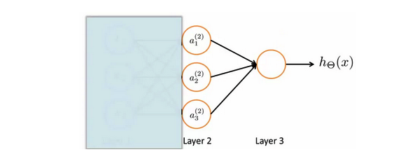
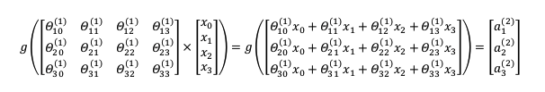
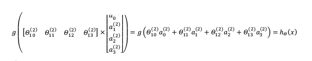

## 第二周笔记 Week_2

### 六、神经网络:表述(Neural Networks:Representation)

#### 6.1 非线性假设

无论逻辑回归还是线性回归，当特征数较多时，高阶多项式组合浪费空间、计算负荷较大，也比较容易出现过拟合。如果删除部分特征，又会导致信息缺失。

#### 6.2 模型表示

构建神经网络模型：

$x_1,x_2,x_3$代表输入单元，$Layer 1$为输入层（Input Layer）。

$a_i^{(j)}$代表第$j$层的第$i$个激活单元。$Layer 2$为隐藏层（Hidden Layers）。

$layer 3$为输出层（Output Layer）。最后输出层类似于逻辑回归算法，但不是使用输入的输入特征。

为表示为predict = dataFeature * parameters的形式，考虑偏置值($Bias$)，将神经网络模型进行改写,针对每一层增加偏置值：

从左至右的过程为前向传播算法 **(Forward propagation)**。

神经网络自行学习特征而不是使用输入数据的初始特征，通过隐藏层计算更加复杂的特征，$\theta$的作用就是选择下一层的新的特征。

由输入层至隐藏层：

由隐藏层至输出层：

如果在第$j$层有$s_j$个单元，在$j+1$层有$s_{j+1}$个单元，则$\theta^{(j)}$的维度为$s_{j+1} * (s_j + 1)$。

#### 6.3 样本和直观理解

XNOR

#### 6.4 多类分类

在神经网络的输出层输出包含多个元素的one-hot向量，可用作多累分类任务。

### 七、神经网络:学习(Neural Networks:Learning)

#### 7.1 代价函数

#### 7.2 反向传播算法

#### 7.3 展开参数

#### 7.4 梯度检验

#### 7.5 随机初始化

#### 7.6 综合

### 八、应用机器学习的建议(Advice for Applying Machine Learning)

#### 8.1 决定下一步做什么

#### 8.2 评估一个假设

#### 8.3 模型选择和交叉验证集

#### 8.4 诊断偏差和方差

#### 8.5 正则化和偏差/方差

#### 8.6 学习曲线

#### 8.7 决定下一步做什么

### 九、机器学习系统的设计(Machine Learning System Design)

#### 9.1 首先要做什么

#### 9.2 误差分析

#### 9.3 类偏斜的误差度量

#### 9.4 查准率和查全率之间的权衡

#### 9.5 机器学习的数据