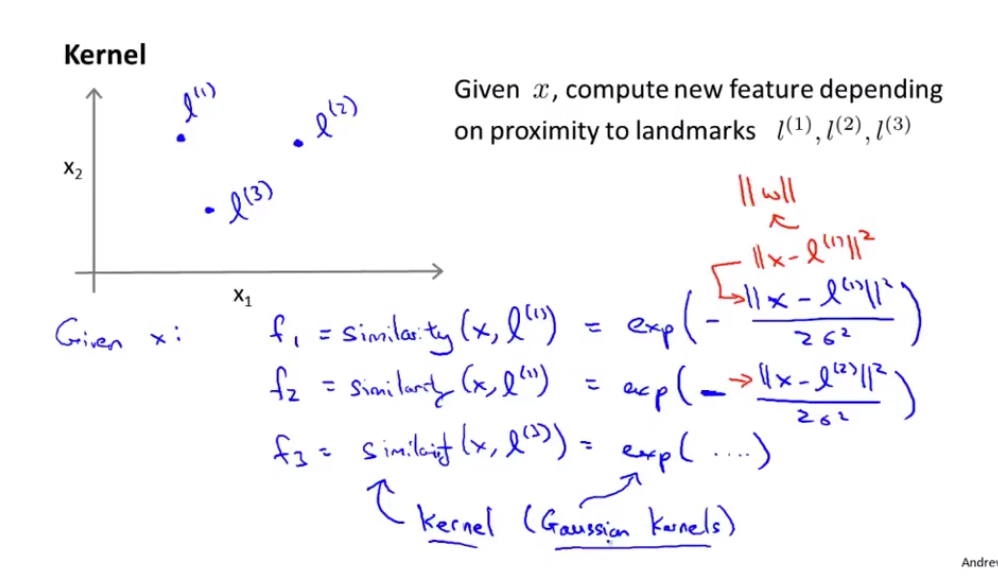
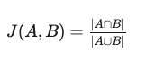
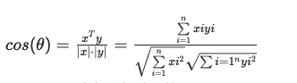
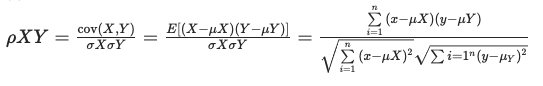

## 第三周笔记 Week_3

### 十、支持向量机(Support Vector Machines)

#### 10.1 优化目标

相比于逻辑回归，SVM采用了新的代价函数:

逻辑回归中的每一项$x$都会为带来损失项，新的损失函数只在$\theta_Tx^{(i)}$大于1或小于-1时才会带来损失项。

$\frac{1}{m}$ 不影响最小值时$\theta$的取值，因此不需要在损失项内再计算 $*\frac{1}{m}$。

同时用新的参数 $C$ 代替了逻辑回归中的超参$\lambda$,这里的C作用类似于$\frac{1}{\lambda}$用来平衡损失项$J$和正则项$R$。但是$C*J+R$与$J+\lambda * R$并不等价。

此时SVM的假设函数和优化目标:

SVM会直接预测 $y$ 的取值是1还是0，而不是类似逻辑回归输出概率。

#### 10.2 大边界的直观理解

SVM也被称为大间距分类器。

当 $y$ 为正样本时，关于 $z$ 的代价函数为 $cost_1(z)$ ,负样本时，代价函数为 $cost_0(z)$。

换句话说，一个正样本，希望 $\theta^Tx>=1$ ，反之，如果 $y=0$ ，函数 ${\cos}t_0{(z)}$ 的值在 $z<=-1$ 的区间里函数值为0。

在其他二分类器中，如果有一个正样本 $y=1$ ，仅要求 $\theta^Tx$ 大于等于0，就能将该样本恰当分出，这是因为如果 $\theta^Tx > 0$，代价函数值为0。一个负样本，仅需要$\theta^Tx <= 0$就可正确分离，但是，支持向量机的要求更高，在正确区分输入样本的同时，增大了区分可信度。相当于在支持向量机中嵌入了一个额外的安全因子（间距因子）。

当 $C$ 值很大时，为使整体cost函数的值降到最低，SVM就必须找到使正负样例最大程度区分的 $\theta$ 。对比下图，即为使正负样例都取最大分割距离的黑线。

这个距离叫做支持向量机的间距，这是**支持向量机具有鲁棒性的原因，因为它努力用一个最大间距来分离样本**。因此支持向量机有时被称为大间距分类器。

当 $C$ 取 **非常大** 值时，SVM对异常样本点更为敏感。$C$ 取不是很大时，可以忽略掉一些异常点，得到更好的的决策边界，甚至可处理非线性可分数据。

#### 10.3 大边界分类背后的数学（选修）

决策边界和参数 $\theta$ 垂直，$\theta$ 是决策面的法向量。

最大间距实际为样本点到 $\theta$ 的投影p值之和最大。

#### 10.4 核函数

**kernel** 核函数：不取代假设函数，而是使用核函数计算新的特征，再代入到假设函数中。核函数定义新的特征变量，实现非线性分类。

如上图，给定三个坐标点（Landmartks），通过计算 $x$ 与 $l^{(1)},l^{(2)},l^{(3)}$ 的相似程度来构造新的特征 $f_1,f_2,f_3$.

kernel 函数为**高斯核函数（Gausssian Kernel）**

此时的假设函数：$h_\theta(x) = \theta_0 + \theta_1 f_1 + \theta_2 f_2 + \theta_3 f_3$，如预测$y = 1$，则 $\theta_0 + \theta_1 f_1 + \theta_2 f_2 + \theta_3 f_3 > 0$。

**如何选择Landmarks?**

可以直接将部分训练样本作为Landamarks，这样得到的新特征是建立在原有特征与训练集中所有其他特征之间距离的基础上。

**关于核函数的正则化**

对SVM进行正则化时，要根据实际特征 $f_{(i)}$ 数考虑实际的参数量。

针对大样本大参数量问题，SVM还可以使用 $\theta^T M \theta$ 代替 $\theta^2$ 作为正则项。

**参数 $C$ 和高斯相似函数 $\sigma$ 的选择**

$C$ 较大时，相当于 $\lambda$ 较小，可能会导致过拟合，高方差；

$C$ 较小时，相当于 $\lambda$ 较大，可能会导致低拟合，高偏差；

$\sigma$ 较大时，可能会导致低方差，高偏差；

$\sigma$ 较小时，可能会导致低偏差，高方差。

#### 10.5 使用支持向量机

1. 利用现有软件包求解参数
2. 选择适当的参数$C$
3. 选择适当的kernel
   
   常用的kernel函数：常用线性核函数、高斯相似核函数

   **如果选择高斯核函数，对于量级差别很大的特征，在使用高斯核函数之前进行特征标准化**

核函数的一些普遍准则：

$n$为特征数，$m$为训练样本数。

(1)如果相较于$m$而言，$n$要大许多，即训练集数据量不够支持我们训练一个复杂的非线性模型，我们选用逻辑回归模型或者不带核函数的支持向量机。

(2)如果$n$较小，而且$m$大小中等，例如$n$在 1-1000 之间，而$m$在10-10000之间，使用高斯核函数的支持向量机。

(3)如果$n$较小，而$m$较大，例如$n$在1-1000之间，而$m$大于50000，则使用支持向量机会非常慢，解决方案是创造、增加更多的特征，然后使用逻辑回归或不带核函数的支持向量机。

**SVM的优化问题是一种凸优化问题，会找到全局最小值。**

### 十一、聚类(Clustering)

#### 11.1 无监督学习：简介

      监督学习算法：给定一个有标签的数据集，目标是找到能够正确区分正样本和负样本的决策边界。

#### 11.2 K-均值算法

**K-Means 算法是最普及的聚类(Clustering)算法。**

K-Means 算法是一种迭代算法：

  1. 首先选择 $K$ 个随机的点，称为聚类中心（cluster centroids）。
  2. 对于数据集中的每一个数据，按照距离 $K$ 个中心点的距离，将其与距离最近的中心点关联起来，与同一个中心点关联的所有点聚成一类。
  3. 计算每一个组的平均值，将该组所关联的中心点移动到平均值的位置。
  4. 重复步骤2-3直至中心点不再变化。

伪代码如下：

      Repeat {
         for i = 1 to m
         c(i) := index (form 1 to K) of cluster centroid closest to x(i)
         for k = 1 to K
         μk := average (mean) of points assigned to cluster k
      }
      
K-Means 算法也可以很便利地用于将数据分为许多不同组，即使在没有非常明显区分的组群的情况下也可以。

#### 11.3 优化目标

K-Means 最优化问题，是要最小化所有的数据点与其所关联的聚类中心点之间的距离之和，因此 K-Means 的代价函数（又称畸变函数 Distortion function）为：

$$ J(c^{(1)},...,c^{(m)},μ_1,...,μ_K)=\dfrac {1}{m}\sum^{m}{i=1}\left| X^{\left( i\right) }-\mu{c^{(i)}}\right| ^{2} $$

优化目标：

#### 11.4 随机初始化

K-Means 根据初始化状态不同可能会收敛至不同的聚类结果。

1. 选择 $K<m$，即聚类中心点的个数要小于所有训练集实例的数量

2. 随机选择 $K$ 个训练实例，然后令 $K$ 个聚类中心分别与这K个训练实例相等

K-Means 可能会停留在局部最优解：可尝试多次**随机初始化**避免出现局部最优解，尝试50-1000次找cost最小值的解。这种方法在$K$较小的时候（2--10）还是可行的，但是如果$K$较大，这么做也可能不会有明显地改善。

#### 11.5 选择聚类数

K-Means 多用作下游任务的预处理，$K$ 值的选择要考虑下游任务的需要。

$K$的选择：Elbow Method，找cost曲线的明显拐点，但不常用。

#### 相似度计算方法

(1).闵可夫斯基距离(Minkowski)

(2).杰卡德相似系数(Jaccard)：

(3).余弦相似度(Cosine similarity)

(4).Pearson皮尔逊相关系数

### 十二、降维(Dimensionality Reduction)

#### 12.1 动机

1.数据压缩：压缩数据维度，保留主要特征。

2.数据可视化：压缩数据维度，实现高维数据可视化。

#### 12.3 主成分分析问题

**主成分分析(PCA)** 找到一个方向向量（Vector direction），当把所有的数据投射到该向量上时，投射平均均方误差能尽可能地小。方向向量是一个经过原点的向量，投射误差是从特征向量向该方向向量作垂线的长度。

将 $n$ 维数据降至 $k$ 维，目标是找到向量 $u^{(1)},u^{(2)},...,u^{(k)}$ 使得总的投射误差最小。

**PCA 与 线性回归的区别：**

线性回归:计算的是垂直距离，用给定的 $x$ 预测 $y_{pre}$ 。

PCA:计算的是投影距离，最短正交距离。在计算时不考虑 $y$ 的影响。

PCA要保证降维后，数据的特征损失最小。

PCA在对数据进行降维处理时，会计算新求出的主元向量的重要性，最大程度的保持了原有数据信息。且结果只与数据相关，与用户独立。

#### 12.4 主成分分析算法

PCA : $n → k$

1. 数据预处理：对数据进行特征缩放和均值标准化（归一化）
2. 计算**协方差矩阵（covariance matrix）**
    $\sum=\dfrac {1}{m}\sum^{m}_{i=1}\left( x^{(i)}\right) \left( x^{(i)}\right) ^{T}$
3. 计算协方差的**特征向量（eigenvectors）**,可使用**奇异值分解（singular value decomposition）** 计算

对于一个$n × n$ , $U$ 是一个具有与数据之间最小投射误差的方向向量构成的矩阵。由 $n → k$，需要从 $U$ 中选取 $k$ 个向量，获得一个 $n × k$ 的矩阵，用 $U_{reduce}$ 表示。

$z^{(i)} = U_{reduce}^T * x^{(i)}$

其中 $x$ 是 $n×1$ 维的，因此结果为 $k×1$ 维度。注，不对方差特征进行处理。

#### 12.5 选择主成分的数量

通过选择不同的$k$值，选择训练集误差尽可能小的值。

可使用SVD计算得到的结果`[U, S, V] = svd(sigma)`中的$S$计算偏差。

$\frac {\frac {1}{m}\sum^{m}_{i=1}\left| x^{(i) }-x^{(i)}_{approx}\right| ^{2}}{\frac{1}{m}\sum^{m}_{i=1}\left| x^{(i)}\right| ^{2}}=1- \frac {\Sigma^{k}_{i=1} S_{ii}}{\Sigma^{m}_{i=1} S_{ii}}\leq 1$

#### 12.6 重建的压缩表示

压缩后的变量：$z=U^{T}_{reduce}x$

相反的方程为：$x_{appox}=U_{reduce}\cdot z,x_{appox}\approx x$

与原始数据存在偏差，这个过程为重建原始数据。

#### 12.7 主成分分析法的应用建议

运用主成分分析时，将 $U_{reduce}$ 作为学习的参数在训练集上训练得到，在交叉验证集和测试集，同样使用训练集上得到的$U_{reduce}$，而不重新训练。

PCA虽然可以降低特征维度，但**不能用于减少过拟合**。主成分分析只是近似的丢弃一些特征，不考虑任何和结果相关的信息，因此可能会丢失重要信息。

**在构建机器学习系统时，最好是从所有原始特征开始，只在必要时（算法运行太慢或占用太多内存时）才考虑使用PCA。**

### 十三、异常检测(Anomaly Detection)

#### 13.1 问题的动机

给定正常数据集 $x^{(1)},x^{(2)},...,x^{(n)}$ ,判定给出的 $x_{test}$ 不属于该数据的几率 $p(x_{test})$。

#### 13.2 高斯分布

高斯分布，也成正态分布。

$x$ 符合高斯分布 $x \sim N(\mu, \sigma^2)$则其概率密度函数为：

$p(x,\mu,\sigma^2)=\frac{1}{\sqrt{2\pi}\sigma}\exp\left(-\frac{(x-\mu)^2}{2\sigma^2}\right)$

利用已有的数据来预测总体中的 $μ$ 和 $σ^2$ 的计算方法如下：

$\mu=\frac{1}{m}\sum\limits_{i=1}^{m}x^{(i)}$

$\sigma^2=\frac{1}{m}\sum\limits_{i=1}^{m}(x^{(i)}-\mu)^2$

高斯分布样例：

#### 13.3 算法

应用高斯分布的异常检测算法：

对于给定的数据集$x^{(1)},x^{(2)},...,x^{(n)}$，针对每一个特征计算$\mu$和$\sigma^2$的估计值：

$\mu_j=\frac{1}{m}\sum\limits_{i=1}^{m}x^{(i)}_j$

$\sigma^2_j=\frac{1}{m}\sum\limits_{i=1}^{m}(x^{(i)}_j-\mu_j)^2$

在给定一个新的训练实例后，根据模型计算$p(x)$:

$p(x)=\prod\limits_{j=1}^np(x_j;\mu_j,\sigma_j^2)=\prod\limits_{j=1}^1\frac{1}{\sqrt{2\pi}\sigma_j}exp(-\frac{(x_j-\mu_j)^2}{2\sigma_j^2})$

当$p(x) < \varepsilon$时，为异常。其中$\varepsilon$为判定边界值。

#### 13.4 开发和评价一个异常检测系统

异常检测算法是一个非监督学习算法，无法根据结果变量 $ y$ 的值来判断数据是否真的是异常的。需要另一种方法来帮助检验算法是否有效。从带标记（异常或正常）的数据着手，从其中选择一部分正常数据用于构建训练集，然后用剩下的正常数据和异常数据混合的数据构成交叉检验集和测试集。

例如：有10000台正常引擎的数据，有20台异常引擎的数据。数据分配如下：

6000台正常引擎的数据作为训练集

2000台正常引擎和10台异常引擎的数据作为交叉检验集

2000台正常引擎和10台异常引擎的数据作为测试集

具体的评价方法如下：

1. 根据测试集数据，估计特征的平均值和方差并构建$p(x)$函数

2. 对交叉检验集，尝试使用不同的$\varepsilon$值作为阀值，并预测数据是否异常，根据$F1$值或者查准率与查全率的比例来选择 $\varepsilon$

3. 选出 $\varepsilon$ 后，针对测试集进行预测，计算异常检验系统的$F1$值，或者查准率与查全率之比

#### 13.5 异常检测与监督学习对比

异常检测中$正样本数 >> 负样本数$

| 异常检测                                | 监督学习                                     |
| ----------------------------------- | ---------------------------------------- |
| 非常少量的正向类（异常数据 $y=1$）, 大量的负向类（$y=0$） | 同时有大量的正向类和负向类                            |
| 许多不同种类的异常，非常难。根据非常少量的正向类数据来训练算法。   | 有足够多的正向类实例，足够用于训练 算法，未来遇到的正向类实例可能与训练集中的非常近似。 |
| 未来遇到的异常可能与已掌握的异常、非常的不同。             |                                          |
| 例如： 欺诈行为检测 生产（例如飞机引擎）检测数据中心的计算机运行状况 | 例如：邮件过滤器 天气预报 肿瘤分类                       |

#### 13.6 选择特征

异常检测算法中，选择特征十分重要：

异常检测算法，即便数据分布不是高斯分布，也可以正常工作。但最好需将数据转化为高斯分布，例如$x = log(x+c)$，其中$c$为非负数；$x = x^c$，$c$为0-1之间的一个分数。

一些异常数据也会$p(x)>\varepsilon$，因此未被检测。可通过误差分析，增加新特征提高算法准确性。也可以通过现有特征组合获得新的更好的特征。

#### 13.7 多元高斯分布

一般的高斯公式误差分析，同时抓取多个特征的偏差，假设各个特征之间相互独立，因此创造的特征边界较大。

多元高斯分布：

$\mu=\frac{1}{m}\sum_{i=1}^mx^{(i)}$

$\Sigma = \frac{1}{m}\sum_{i=1}^m(x^{(i)}-\mu)(x^{(i)}-\mu)^T=\frac{1}{m}(X-\mu)^T(X-\mu)$

计算所有特征的平均值，之后计算协方差矩阵。

$p(x)=\frac{1}{(2\pi)^{\frac{n}{2}}|\Sigma|^{\frac{1}{2}}}exp\left(-\frac{1}{2}(x-\mu)^T\Sigma^{-1}(x-\mu)\right)$

原本高斯分布模型为多元高斯分布模型的一个子集。如果协方差矩阵只在对角线上的单位有非零值，则为原本高斯分布

多元高斯分布应用过程：

| 原高斯分布模型                                               | 多元高斯分布模型                                             |
| ------------------------------------------------------------ | ------------------------------------------------------------ |
| 不能捕捉特征之间的相关性 但可以通过将特征进行组合的方法来解决 | 自动捕捉特征之间的相关性                                     |
| 计算代价低，能适应大规模的特征                               | 计算代价较高 训练集较小时也同样适用                          |
|                                                              | 必须要有 $m>n$，不然的话协方差矩阵$\Sigma$不可逆的。 |

如果特征之间存在某种相互关联，可构造新特征方法来模拟关联性。

如果训练集较小，特征较少，可以使用多元高斯分布模型。

