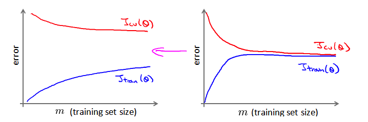
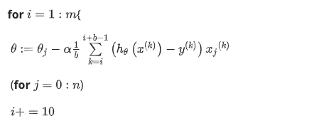
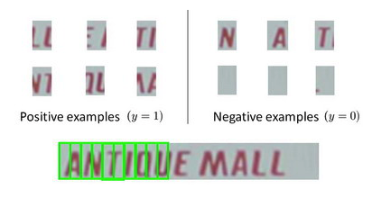
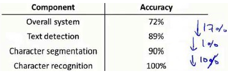
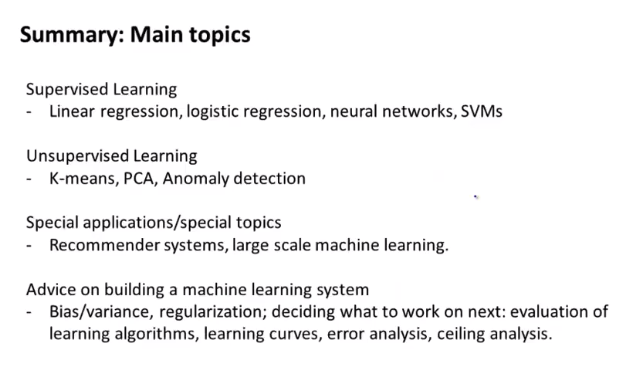

## 第四周笔记 Week_4

### 十四、推荐系统(Recommender Systems)

#### 14.1 问题形式化

根据用户的评分，以及电影特征预测客户喜好。

#### 14.2 基于内容的推荐系统

$n_u$ : 代表用户的数量

$n_m$ : 代表电影的数量

$r(i,j)$ : 如果用户$j$给电影 $i$ 评过分则 $r(i,j)=1$

$y(i,j)$ : 代表用户 $j$ 给电影$i$的评分

$m_j$ 代表用户 $j$ 评过分的电影的总数

对于用户 $j$ 针对电影 $i$ ，预测的评分为 $(\theta^{(j)})^Tx^{(i)}$

$\theta^{(j)}$ : 用户$j$的参数向量

$x^{(i)}$ : 电影$i$的特征向量

**代价函数**：针对用户 $j$：

$$
\min_{\theta (j)}\frac{1}{2}\sum_{i:r(i,j)=1}\left((\theta^{(j)})^Tx^{(i)}-y^{(i,j)}\right)^2+\frac{\lambda}{2}\left(\theta_{k}^{(j)}\right)^2
$$

其中 $i:r(i,j)$ 表示只计算用户 $j$ 评分过的电影，不对方差项 $\theta_0$ 进行正则化处理。

对于所有用户：

$$
\min_{\theta^{(1)},...,\theta^{(n_u)}} \frac{1}{2}\sum_{j=1}^{n_u}\sum_{i:r(i,j)=1}\left((\theta^{(j)})^Tx^{(i)}-y^{(i,j)}\right)^2+\frac{\lambda}{2}\sum_{j=1}^{n_u}\sum_{k=1}^{n}(\theta_k^{(j)})^2
$$

应用梯度下降算法求解最优参数：

$$
\theta_k^{(j)}:=\theta_k^{(j)}-\alpha\sum_{i:r(i,j)=1}((\theta^{(j)})^Tx^{(i)}-y^{(i,j)})x_{k}^{(i)} \quad (\text{for} \, k = 0)
$$

$$
\theta_k^{(j)}:=\theta_k^{(j)}-\alpha\left(\sum_{i:r(i,j)=1}((\theta^{(j)})^Tx^{(i)}-y^{(i,j)})x_{k}^{(i)}+\lambda\theta_k^{(j)}\right) \quad (\text{for} \, k\neq 0)
$$

#### 14.3 协同过滤

基于内容的推荐系统，在掌握了可用特征后，可训练出用户参数。如果拥有用户参数，也可训练电影特征：

$$
\mathop{min}\limits_{x^{(1)},...,x^{(n_m)}}\frac{1}{2}\sum_{i=1}^{n_m}\sum_{j{r(i,j)=1}}((\theta^{(j)})^Tx^{(i)}-y^{(i,j)})^2+\frac{\lambda}{2}\sum_{i=1}^{n_m}\sum_{k=1}^{n}(x_k^{(i)})^2
$$

协同过滤算法可以同时学习两种参数，优化目标为$x$和$\theta$:

$$
J(x^{(1)},...x^{(n_m)},\theta^{(1)},...,\theta^{(n_u)})=\frac{1}{2}\sum_{(i:j):r(i,j)=1}((\theta^{(j)})^Tx^{(i)}-y^{(i,j)})^2+\frac{\lambda}{2}\sum_{i=1}^{n_m}\sum_{k=1}^{n}(x_k^{(j)})^2+\frac{\lambda}{2}\sum_{j=1}^{n_u}\sum_{k=1}^{n}(\theta_k^{(j)})^2
$$

对代价函数求偏导数：

$$
x_k^{(i)}:=x_k^{(i)}-\alpha\left(\sum_{j:r(i,j)=1}((\theta^{(j)})^Tx^{(i)}-y^{(i,j)}\theta_k^{j}+\lambda x_k^{(i)}\right)
$$

$$
\theta_k^{(i)}:=\theta_k^{(i)}-\alpha\left(\sum_{i:r(i,j)=1}((\theta^{(j)})^Tx^{(i)}-y^{(i,j)}x_k^{(i)}+\lambda \theta_k^{(j)}\right)
$$

注：在协同过滤从算法中，通常不使用方差项，如果需要的话，算法会自动学得。
协同过滤算法使用步骤如下：

1. 初始 $x^{(1)},x^{(1)},...x^{(n_m)},\ \theta^{(1)},\theta^{(2)},...,\theta^{(n_u)}$为一些随机小值

2. 使用梯度下降算法最小化代价函数

3. 在训练完算法后，预测$(\theta^{(j)})^Tx^{(i)}$为用户 $j$ 给电影 $i$ 的评分

**协同过滤优化目标：**

给定$x^{(1)},...,x^{(n_m)}$，估计$\theta^{(1)},...,\theta^{(n_u)}$：
$$
\min_{\theta^{(1)},...,\theta^{(n_u)}}\frac{1}{2}\sum_{j=1}^{n_u}\sum_{i:r(i,j)=1}((\theta^{(j)})^Tx^{(i)}-y^{(i,j)})^2+\frac{\lambda}{2}\sum_{j=1}^{n_u}\sum_{k=1}^{n}(\theta_k^{(j)})^2
$$

给定$\theta^{(1)},...,\theta^{(n_u)}$，估计$x^{(1)},...,x^{(n_m)}$：

同时最小化$x^{(1)},...,x^{(n_m)}$和$\theta^{(1)},...,\theta^{(n_u)}$：
$$
J(x^{(1)},...,x^{(n_m)},\theta^{(1)},...,\theta^{(n_u)})=\frac{1}{2}\sum_{(i,j):r(i,j)=1}((\theta^{(j)})^Tx^{(i)}-y^{(i,j)})^2+\frac{\lambda}{2}\sum_{i=1}^{n_m}\sum_{k=1}^{n}(x_k^{(i)})^2+\frac{\lambda}{2}\sum_{j=1}^{n_u}\sum_{k=1}^{n}(\theta_k^{(j)})^2
$$

$$
\min_{x^{(1)},...,x^{(n_m)} \ \theta^{(1)},...,\theta^{(n_u)}}J(x^{(1)},...,x^{(n_m)},\theta^{(1)},...,\theta^{(n_u)})
$$

#### 14.4 向量化：低秩矩阵分解

通过计算电影 $i$ 与电影 $j$特征向量 $x^{(i)}$ 与 $x^{(j)}$ 的相似度，即进行用户电影推荐。 

#### 14.5 推行工作上的细节：均值归一化

对于一个给定的新用户：

需要对结果 $Y$ 矩阵进行均值归一化处理，将每一个用户对某一部电影的评分减去所有用户对该电影的平均值。

利用新的 $Y$ 训练算法，用新训练的算法来预测评分，需要将平均值重新加回，预测$(\theta^{(j)})^T x^{(i)}+\mu_i$。以均值作为新用户的参数。

### 十五、大规模机器学习(Large Scale Machine Learning)

#### 15.1 大型数据集的学习

对于一个非常大的训练集，每次迭代的代价非常大。可以通过绘制学习曲线，判断是否有必要用非常大的数据集。

#### 15.2 随机梯度下降法

**Stochastic Gradient Descent**

定义单一样本代价函数：

$cost(\theta,(x^{(i)},y^{(i)})) = \frac{1}{2}(h_\theta(x^{(i)}) - y^{(i)})^2$

随机梯度下降算法：

梯度下降算法会在最小值附近徘徊，得到的不是全局最小值而是其近似值。

#### 15.3 小批量梯度下降

**Mini-Batch Gradient Descent**

随机梯度下降和梯度下降的折中，$b$的通常选择为2-100。

#### 15.4 随机梯度下降收敛

**Stochastic Gradient Descent Convergence**

对一定批量的代价，计算平均值后绘制图表，通过曲线判断随机梯度下降算法是否正常工作：

可通过减少学习率达到更好的效果，但一般不需要这么做。

#### 15.5 在线学习

动态获得数据对参数进行更新，不必构建一个固定的训练集执行梯度计算，根据用户不断产生的数据中来学习。

#### 15.6 映射化简和数据并行

**分布式？**

### 十六、应用实例：图片文字识别(Application Example: Photo OCR)

#### 16.1 问题描述和流程图

问题描述：在一张给定的图片中识别文字

为了完成这样的工作，需要采取如下步骤：

1. 文字侦测（Text detection）——将图片上的文字与其他环境对象分离开来
2. 字符切分（Character segmentation）——将文字分割成一个个单一的字符
3. 字符分类（Character classification）——确定每一个字符是什么

#### 16.2 滑动窗口

#### 16.3 获取大量数据和人工数据

1. 人工数据合成
2. 手动收集、标记数据
3. 众包

#### 16.4 上限分析：哪部分管道的接下去做

1. 选择文字检测部分准确率100%
2. 在1的前提下，字符切分准确率100%
3. 在2的前提下，字符分类准确率100%

选择优化提升上限最大的部分。

### 十七、总结(Conclusion)

